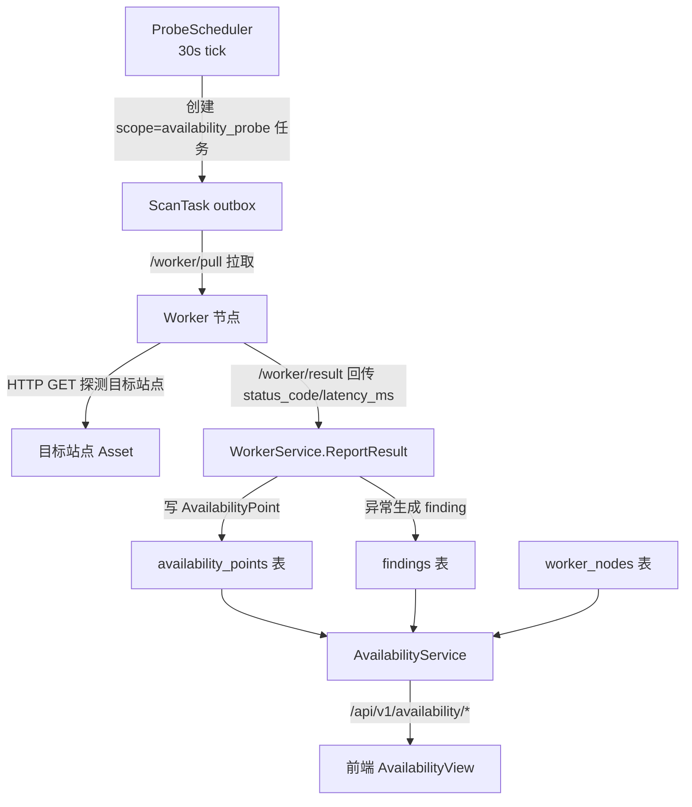
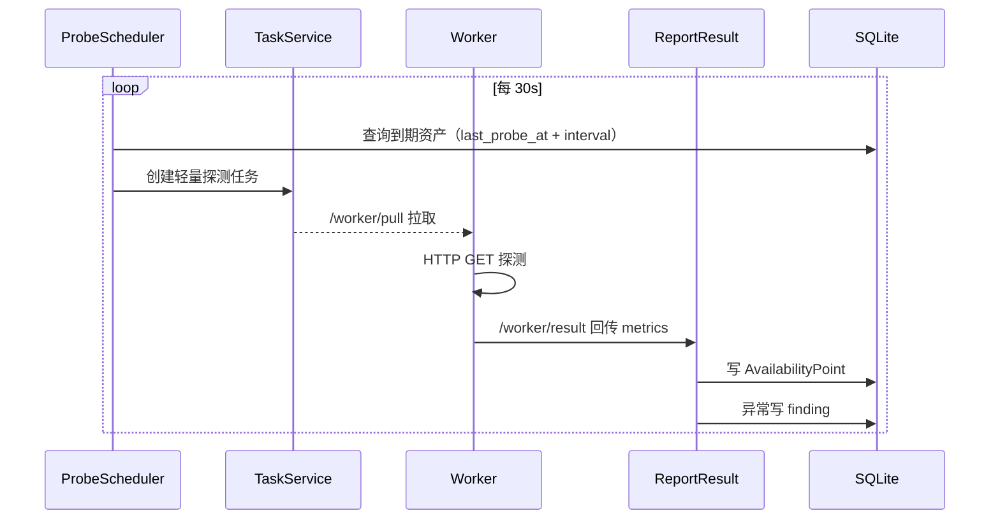

# 可用性监测模块技术设计

Feature Name: availability-monitoring
Updated: 2026-08-22

## Description

将 CInsight 平台的可用性监测从「半成品」补全为完整产品能力：新增轻量可用性探针调度与 `AvailabilityPoint` 时序采集，新增站点可用性列表/时序/重新探测/白名单 API，新增前端可用性监测页面（三栏筛选 + Sparkline + 工作节点拓扑 + 全局搜索）。配套落地《交互逻辑规范》通用交互。

## Architecture

### 探针调度流程

## Components and Interfaces

### 后端

#### 1. ProbeScheduler（新增 `internal/master/service/probe_scheduler.go`）
- 结构仿 `CronScheduler`：`DB`、`Task`、`License`、`Now`（可注入时间）。
- `Run(ctx)`：`time.NewTicker(30s)` 循环调用 `tick()`。
- `tick()`：授权有效时，扫描启用可用性监测的资产，按「上次探测时间 + 探测间隔」判断到期，批量创建轻量探测任务。
- 探测间隔：默认 5 分钟，可经环境变量 `CINSIGHT_AVAIL_INTERVAL_SECONDS` 覆盖。
- 资产到期判定依赖 `AvailabilityPoint` 最新 `sampled_at`（未探测过即视为到期）。

#### 2. TaskService（扩展 `internal/master/service/task.go`）
- `ScanTask.TaskScope` 新增值 `availability_probe`。
- `Create` 增加 `task_scope` 参数（当前固定 `"root"`），轻量探测任务 `task_scope=availability_probe`、引擎仅 `availability`。
- 去重逻辑复用（同资产有进行中探测任务则跳过）。

#### 3. Worker 探测（扩展 `cmd/worker/main.go`）
- 拉取到 `task_scope=availability_probe` 的任务时，仅执行 HTTP GET 探针（不复用完整扫描递归/引擎管线）。
- 回传 `Metrics: { status_code, latency_ms }`；连续失败/状态码≥400/耗时超阈值时按现有逻辑生成 finding。
- 复用现有 `availability` 引擎配置（fail_count=3、slow_threshold_ms=3000）。

#### 4. WorkerService.ReportResult（扩展 `internal/master/service/worker.go`）
- 在 result 处理后新增：若 `result.Metrics` 含 `status_code` 且 `task.TaskScope == "availability_probe"`，写一条 `AvailabilityPoint`（`asset_id`、`engine="availability"`、`status_code`、`response_ms`、`sampled_at=now`）。
- 幂等：`ReportResult` 已按 `result_id` 去重，同一探测不会重复写时序点。
- 白名单过滤：站点命中 `ScanWhitelist` 时，不将可用性异常 finding 转化为告警（finding 仍落库，供审计）。

#### 5. AvailabilityService（新增 `internal/master/service/availability.go`）
- `List(filter, page)`：关联 `Asset` 与最新 `AvailabilityPoint`，聚合可用性状态（正常/异常/未知），支持状态码/状态/关键词筛选与分页。
- `Timeseries(assetID, from, to)`：查询该资产时序点，按 `sampled_at` 升序返回。
- `Reprobe(assetIDs)`：对指定资产立即创建轻量探测任务。
- `WorkerTopology()`：返回 master 元信息 + `WorkerNode` 列表（名称/IP/状态/负载/心跳）。

#### 6. Routes（扩展 `internal/master/routes/`）
- 新增 `availability_routes.go`，注册到 `authed` 分组：
  - `GET /api/v1/availability/list`
  - `GET /api/v1/availability/:id/timeseries`
  - `POST /api/v1/availability/reprobe`
  - `GET /api/v1/availability/worker-topology`
- 白名单复用现有 `ScanWhitelist`（策略模块已具备 domain/ip/cidr 规则），新增查询/增删接口或复用现有策略路由。

### 前端

#### 7. 路由与菜单（`frontend/src/config/routes.ts`）
- 新增 `APP_ROUTES` 项 `/availability`（name `availability`，title「可用性监测」）。
- `MENU` 新增 `{ title: '可用性监测', path: '/availability', roles: ['admin','user'] }`。

#### 8. API 封装（新增 `frontend/src/api/availability.ts`）
- `getAvailabilityList(filter, page)`、`getAvailabilityTimeseries(id, range)`、`reprobe(ids)`、`getWorkerTopology()`。

#### 9. 页面（新增 `frontend/src/views/availability/AvailabilityView.vue`）
- 三栏布局：左菜单（已有）+ 中栏筛选面板 + 右栏站点表格。
- 中栏筛选：状态码分组、可用性状态分组、关键词搜索（防抖 300ms）。
- 表格列：站点名、URL、可用性状态、状态码、响应耗时、最后探测时间、24h Sparkline。
- 行操作：重新探测、加入白名单、查看详情（打开详情抽屉）。
- 批量操作栏：全选 + 批量重新探测 + 批量加入白名单。

#### 10. 拓扑组件（新增 `frontend/src/views/availability/WorkerTopology.vue`）
- 用 ECharts graph 展示 master + worker 节点；在线绿点、离线灰点；hover 显示 Tooltip；点击跳详情。

#### 11. 全局搜索（新增 `frontend/src/components/GlobalSearch.vue`）
- 全局挂载，监听 `Cmd/Ctrl+K` 唤起、`Esc` 关闭；防抖搜索站点/资产/发现；选中跳转。

#### 12. 通用交互落地（组件化）
- 按钮状态、Toast 规范对齐、Modal 二次确认、Tooltip、空状态、表格排序、分页器、无障碍 focus、`prefers-reduced-motion`。

## Data Models

复用现有模型，无需新表（`AvailabilityPoint` 已定义）：

| 模型 | 用途 | 变更 |
|------|------|------|
| `AvailabilityPoint` | 可用性时序点（AssetID/Engine/StatusCode/ResponseMs/SampledAt） | 无（已定义，开始写入） |
| `ScanTask` | 任务，新增 `task_scope=availability_probe` | 复用，扩展 scope 值 |
| `WorkerNode` | 工作节点拓扑数据源 | 无 |
| `ScanWhitelist` | 白名单规则 | 无 |
| `Asset` | 站点（url/name/group_name/importance） | 无 |

时序点保留策略：定时清理 7 天前的 `AvailabilityPoint`（防无限增长）。

## Correctness Properties

1. 幂等：`ReportResult` 按 `result_id` 去重，同一探测任务回传结果不会重复写时序点。
2. 单点采集：同一资产同一时刻最多一个进行中探测任务（复用任务去重）。
3. 白名单一致性：命中白名单的站点不产生可用性告警，但时序点仍正常采集。
4. 授权约束：授权无效时 `ProbeScheduler` 停止创建探测任务（复用 `License.Check()`）。

## Error Handling

| 场景 | 处理 |
|------|------|
| 探测连接失败/超时 | worker 回传 `status=failed`，写不可用状态（status_code=0 或专用标记），生成 unreachable finding |
| 探测任务创建冲突 | 去重跳过，记录日志 |
| 时序点查询无数据 | 返回空数组，前端显示「暂无趋势数据」占位 |
| 重新探测未选中站点 | 返回校验错误，前端 Toast 提示 |
| 调度循环 panic | 复用 `middleware.Recovery` 与 `log` 记录，不中断服务 |

## Test Strategy

- 后端单测：
  - `ProbeScheduler.tick`：到期判断、任务创建、授权无效跳过、探测间隔覆盖。
  - `ReportResult`：metrics 写 `AvailabilityPoint`、result_id 幂等去重、白名单过滤告警。
  - `AvailabilityService`：状态聚合（正常/异常/未知）、筛选组合、时序排序、分页。
- 前端测试（Vitest）：
  - 可用性列表渲染、筛选联动、Sparkline 数据空态、批量操作触发、全局搜索唤起/关闭。
- 联调验证：后端跑 8080，前端跑 5173，`curl localhost:5173/api/v1/availability/list` 返回 JSON。

## References

[^1]: `backend/internal/master/service/cron_scheduler.go` — 调度循环参考实现（30s tick + 到期判定）
[^2]: `backend/internal/master/service/worker.go#L303` — `ReportResult` 结果回传处理（时序点写入接入点）
[^3]: `backend/internal/master/models/models.go#L422` — `AvailabilityPoint` 时序点模型
[^4]: `backend/internal/master/routes/routes.go#L65` — 路由注册入口
[^5]: `frontend/src/config/routes.ts` — 前端菜单/路由注册
[^6]: `frontend/src/views/dashboard/DashboardView.vue` — ECharts 封装与图表用法参考
