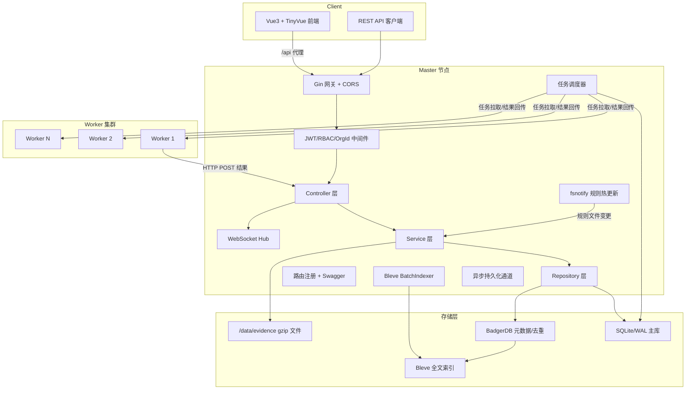
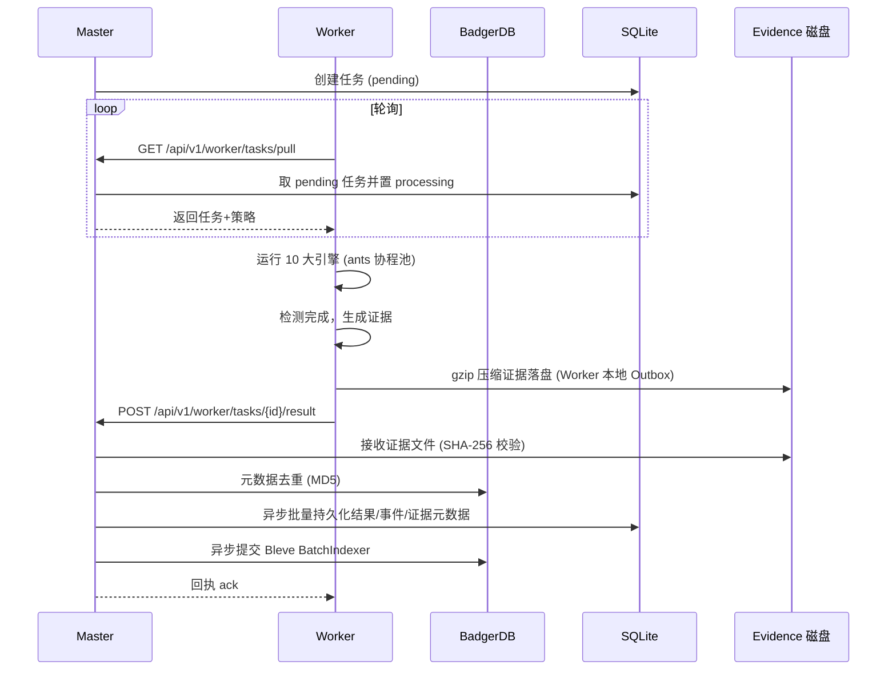
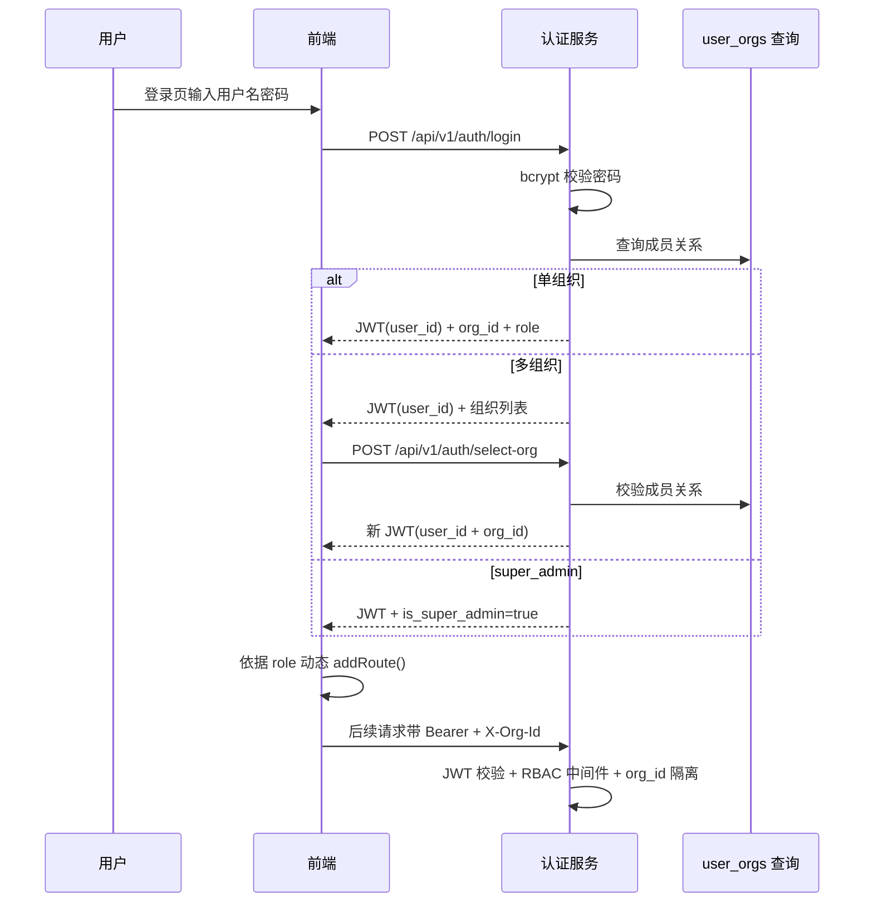

# CInsight 智能监测平台 — 技术设计文档

Feature Name: cinsight-platform
Updated: 2026-08-19
Status: 已确认（技术栈全套 / 全量设计+分阶段实施 / 内嵌库降级方案）

## Description

CInsight 是基于 Master-Worker 架构的多租户安全监测平台。Master 负责 API、任务调度、持久化与证据管理，Worker 负责执行 10 大检测引擎并回传结果。平台以"全量证据链"为核心取证理念，通过 SHA-256 签名保证证据不可篡改，通过多租户 RBAC 保证数据隔离。

技术方案遵循三项用户确认的决策：
1. **全套技术栈落地**：后端 Gin + GORM + SQLite/WAL + BadgerDB + Bleve + ants + gobreaker + fsnotify + swaggo + gorilla/websocket；前端 Vue3 + Vite + Pinia + Router4 + ReconnectingWebSocket + TinyVue。
2. **全量设计 + 分阶段实施**：设计覆盖 10 引擎与 15+ 功能模块，实施按 MVP → 引擎扩展 → 全量功能三个阶段推进。
3. **内嵌库降级方案**：BadgerDB、Bleve 直接作为 Go 内嵌库引入；VictoriaMetrics 时序能力由 SQLite 时序表（`availability_points` / `trend_points`）替代，保留未来迁移接口。

## Architecture

### 总体架构



### Master-Worker 协作时序



### 多租户与 RBAC 认证流程



## Components and Interfaces

### Master 组件

| 组件 | 职责 | 关键接口 |
|------|------|---------|
| Gateway | Gin 引擎、CORS、日志、恢复中间件 | `gin.New()` |
| AuthMiddleware | JWT 校验 + 解析 user_id/org_id | `Authorization: Bearer {jwt}`, `X-Org-Id: {org_id}` |
| RBACMiddleware | 按角色校验写操作权限 | `RequireRoles(role...)`, `RequireWrite()` |
| OrgIsolation | 强制业务查询附带 org_id | `WithOrg(ctx, orgID)` |
| Controller | 各功能模块 HTTP 处理器（验证请求参数） | `assetsController`, `taskController`, `eventController`... |
| Service | 业务逻辑层（脱敏/风暴抑制/证据校验） | `assetsService`, `evidenceService`... |
| Repository | GORM/SQLite + BadgerDB 数据访问 | `assetRepo`, `taskRepo`, `eventRepo`, `kvRepo` |
| TaskScheduler | 任务分发、超时对账、断点续扫状态 | `PullTask()`, `MarkProcessing()`, `AckResult()` |
| CronScheduler | 按 scan_plans.cron_expr 定时生成 scan_tasks、按 report_templates.cron_expr 定时生成 reports（计划/模板绑定时区计算；paused/组织禁用/到期跳过触发，启用后恢复；计划 time_window 窗口外跳过触发） | `GenerateTasks()`, `Tick()` |
| WebSocketHub | 实时事件推送、指数退避重连 | `Broadcast(event)` |
| BatchIndexer | Bleve 批量索引（5s/50 条） | `Enqueue(doc)`, `Flush()` |
| AsyncPersist | 异步持久化通道（写入收敛单协程，BadgerDB 元数据 + 事件/审计落库） | `Enqueue(write)` |
| RuleWatcher | fsnotify 规则热加载 | `WatchRules()`, `GetRuleHash()` |

### Worker 组件

| 组件 | 职责 | 关键接口 |
|------|------|---------|
| EngineRegistry | 10 大引擎注册表，统一契约 | `Register(name, engine)`, `Get(name)` |
| Scheduler | 拉取任务、并发执行、超时控制 | `PollAndRun()` |
| Reporter | HTTP POST 回传结果 + Outbox 缓存 | `ReportResult()`, `ReplayOutbox()` |
| Engine | 统一引擎接口 | `Run(ctx, target, policy) ([]Finding, error)` |
| localStore | BadgerDB 本地状态（已爬取 URL/Outbox） | `Set`, `Get`, `Scan` |
| HeadlessBrowser | 无头浏览器截图取证组件 | `Screenshot(ctx, url) ([]byte, error)` |
| AIAdapter | AI 内容分类服务适配层（endpoint/model/key 可注入，失败回退正则） | `Classify(ctx, text) (Category, Confidence, error)` |
| MultiUAAssessor | 多端 UA 综合评估器（PC/标准移动 UA/微信 UA/移动视口模拟四探针，基础+特征+场景三级加权评分出结论，SimHash 相似度/SPA 容错） | `Assess(ctx, target) (*MultiUAReport, error)` |
| WorkerAuth | Bootstrap Token 注册握手，换取长期凭证 | `Register(token) (clientID, clientSecret)`, `Heartbeat()` |

### Worker 注册握手与凭证生命周期

- **首次注册**：Worker 启动携带安装时下发的 Bootstrap Token 调用 `POST /api/v1/worker/register`，Master 校验 Token 有效（未过期/未使用）后签发长期凭证 `worker_client_id + worker_client_secret`（服务端存 hash），Token 一次性使用即作废。
- **凭证存储**：Bootstrap Token 与长期凭证在库中一律不落明文——Bootstrap Token 存 hash（SHA-256）且仅可读一次（领取即失效），`worker_client_secret` 存 bcrypt/hash，页面列表仅展示掩码；Token 值只在创建时一次性返回并可一键复制，刷新即作废旧值。
- **后续鉴权**：Worker 心跳/拉取/回传均用长期凭证（`X-Worker-ID` + `X-Worker-Secret` 或 Basic Auth），不再依赖 Bootstrap Token。
- **凭证轮换**：Master 可撤销/重发凭证，泄露时可吊销；Worker 离线超期（心跳间隔 3 倍默认 15s 无心跳，见 worker_nodes 表定义）标记离线，可被删除（DELETE /api/v1/worker/nodes/:id）。
- **受邀成员首次登录激活**：邀请发出后成员状态 `invited`，首次登录（验证码/初始密码）后自动激活为 `active`，同时强制设密码/改密；邀请链接过期时间（默认 7 天）。
- **系统级邮件发送**：forgot-password 验证码、reset-password 确认、成员邀请邮件由系统级 SMTP（`CINSIGHT_SMTP_*`）发送，与组织 `notify_channels` 的 SMTP 渠道解耦——登录前与未入组场景无组织上下文，只能走系统 SMTP。验证码 5 分钟有效、一次性使用（服务端存储 hash + 失效时间，使用后即删）。

### 页面截图取证（无头浏览器组件）

- Worker 内嵌无头浏览器截图组件（Go 侧集成 `chromedp` 或独立浏览器进程，Docker 镜像含 chromium），负责页面渲染截图。
- 调用链：引擎产出 finding → 需截图时调用 `HeadlessBrowser.Screenshot(ctx, url)` → 渲染页面（viewport 1440x900，等待 DOMContentLoaded + 2s）→ 输出 PNG → 与 Req/Resp/HTML 一并经证据链路 gzip 落盘 + SHA-256 入库。
- 失败降级：浏览器不可用/渲染超时（>30s）时降级为不截图，仅保留 Req/Resp/HTML 证据并标记 `screenshot: skipped`，不阻断任务。
- 资源控制：截图并发受 `ants` 池约束，浏览器进程内存上限（如 512MB），Worker 低资源环境可禁用截图（策略开关）。
- 截图复用：同一 URL 同一任务内截图结果缓存（BadgerDB key `local:screenshot:{url}:{hash}`），避免重复渲染。

### HAR 文件生成

- Worker 在采集 Req/Resp 证据时按 HAR 1.2 规范组装 HAR 文件（`{"log": {"version": "1.2", "creator": {...}, "entries": [...]}}`），每个 entry 含请求/响应头、URL、HTTP 版本、方法、状态码、Body（text 与 encoding）、时间戳（startedDateTime/time）、大小（headersSize/bodySize）、MIME 类型。
- HAR 文件随证据链 gzip 落盘（`/data/evidence/{date}/`）并经 SHA-256 入库；前端证据抽屉提供下载按钮 `GET /api/v1/evidence/:id/download?format=har`，可导入浏览器开发者工具（Chrome/DevTools/Fiddler）复现分析。
- Body 超限截断策略：HAR 中响应体默认截断至 1MB（configurable `CINSIGHT_HAR_MAX_BODY`），截断标记 `_truncated: true`；完整响应体仍在 HTML/Resp 快照证据中保留。

### 证据文件传输协议（Worker→Master）

- **内联小文件**：单证据 < 1MB 时随结果 JSON 内联回传（Base64 + sha256），Master 直接落盘，无额外请求。
- **分片上传**：≥ 1MB 走 `POST /api/v1/worker/evidence`（multipart/form-data：`upload_id + part_index + part_total + data + sha256`，对应 evidence_files 表 upload_id/part_index/part_total 字段），单片 ≤ 8MB，顺序上传；Master 收齐合并至 `/data/evidence/{date}/` 后复算 SHA-256 校验，入库返回 `evidence_id`。
- **断点续传**：`upload_id` 对应 Master 临时目录，重传时携带 `resume=true` 返回已收分片列表，Worker 仅补传缺失分片；传输超时（30min）后由 Master 清理临时分片并允许 Worker 重新发起。
- **结果关联**：结果回传 `POST /api/v1/worker/tasks/:id/result` 以 `evidence_ids` 数组引用证据，证据与 finding/event 关联，避免重复回传。

### AI 内容分类服务适配层

- 内容安全引擎的 AI 文本分类走 `AIAdapter`，支持可配置 `endpoint / model / api_key`（环境变量 `CINSIGHT_AI_ENDPOINT`、`CINSIGHT_AI_MODEL`、`CINSIGHT_AI_API_KEY` 注入），api_key 由管理员自行配置（K8s Secret），禁止硬编码。
- 适配层接口统一：`Classify(ctx, text) (category, confidence, error)`，支持 OpenAI 兼容协议。
- **失败回退**：AI 服务不可用/超时（>5s）/429 限流时自动回退到内置敏感词正则引擎判定，判定结果标记 `source: regex`；AI 正常时标记 `source: ai`，双结果可并展示。
- 结果缓存：同一文本片段结果缓存（BadgerDB，TTL 24h），降低 AI 调用量；调用并发受池约束，失败熔断（gobreaker，连续 5 次熔断 30s 后自动切正则）。

### 多端 UA 综合评估器（MultiUAAssessor）

- **定位**：Worker 侧共享组件，供内容安全引擎与可用性监测引擎复用。同一目标以多端视角抓取比对，输出三级加权评分与结论，识别单端隐藏敏感内容、"只对手机/微信内展示"的定向投毒（UA 投毒/差异化响应）、端差异化宕机/拦截、条件性篡改与 UA 条件加载暗链。
- **四探针组**（并发受限，默认 2）：
  - PC 探针：随机 PC 端 UA（Chrome/Edge/Firefox 桌面 UA 池随机），视口 1440x900，普通 HTTP 抓取。
  - 移动 UA 探针：随机标准移动 UA（iOS/Android Safari/Chrome UA 池随机），移动视口，普通 HTTP 抓取。
  - 微信 UA 探针：微信内置浏览器 UA（含 `MicroMessenger` 标识），移动视口，普通 HTTP 抓取——覆盖"仅微信内置浏览器放行"的黑产投毒。
  - 移动模拟探针：无头浏览器（chromedp）以移动 UA + 手机宽度视口（默认 375x812，configurable `CINSIGHT_MULTIUA_VIEWPORT`）+ touch 模拟执行 JS 渲染抓取。
  - 每探针独立记录：status_code、重定向链路、latency_ms、title、图片 Hash 集、正文 DOM 结构指纹、外链集合、敏感词命中列表、页面大小。
- **三级加权评分**（总分 0-100，权重默认：基础 20% / 特征 50% / 场景 30%，可经策略模板覆盖）：

  | 级 | 维度与判定依据 | 默认权重 |
  |----|--------------|---------|
  | 基础分（请求阶段） | 状态码分类（200 低分 / 404 中分 / 403 反爬拦截 / 5xx 高分）、重定向链路差异（PC 跳首页而移动端跳非法页）、延迟/超时偏差 | 20% |
  | 特征分（内容检测阶段） | 对 PC 与移动端分别独立计分取最高：敏感词库命中（数量与权重，涉政/涉黄/涉赌/暴恐加权）、隐蔽链特征（`display:none`/hidden/极小字体/前景背景同色）、JS 混淆与恶意跳转（高度混淆代码、`location.href` 强制跳转）、隐藏 iframe 嵌套 | 50% |
  | 场景分（差异化对比与容错阶段） | DOM 结构差异（SimHash 相似度 >90% 的细微差异如时间戳/随机数不加分，主体内容变化才加分）、敏感词分布差异（PC 无命中而移动端命中 → 移动端定向投毒）、内容长度突变（一端代码量远超另一端）；容错：SPA 空壳识别（`<div id="root">`/`<router-view>` 等单页应用特征）标记 `spa_suspected` 待人工复核而非覆盖，仅当移动端具备完整页面特征（Doctype + 标准 Head/Body 闭合 + 长度 >1000）才执行覆盖逻辑 | 30% |

- **综合分与结论分级**：`total = 基础分×0.2 + 特征分×0.5 + 场景分×0.3`，0-100；结论与处置：0-30 正常（仅记录）/ 30-60 可疑（待人工复核）/ 60-85 高危（生成告警并推送）/ 85-100 严重（生成告警 + 创建处置工单，紧急推送）。端级明细记录"哪一端异常、异常类型、对应级得分"。
- **输出与回传**：报告结构写入 finding `Extra["multi_ua"]`：

  ```json
  {
    "probes": [
      {"group":"pc","status":200,"redirects":[],"latency_ms":120,"hit_sensitive":false,"title":"..."},
      {"group":"mobile_ua","status":200,"redirects":[],"latency_ms":180,"hit_sensitive":true,"sensitive_hits":["x"]},
      {"group":"mobile_wechat","status":200,"redirects":["/wx/landing"],"latency_ms":160,"hit_sensitive":true,"sensitive_hits":["y"]},
      {"group":"mobile_viewport","status":403,"hit_sensitive":false,"probe_failed":false}
    ],
    "scores": {"base":20,"feature":70,"scene":40},
    "total_score": 56,
    "conclusion": "suspicious",
    "abnormal_ends": ["mobile_viewport"],
    "dom_similarity": 0.45,
    "spa_suspected": false
  }
  ```

  任一探针失败/超时（>30s）标记 `probe_failed: true`，不计入权重，其余探针正常评估。
- **证据链**：各探针 HTML 快照与移动模拟截图随证据链 gzip 落盘 + SHA-256 入库，前端多端对比标签页展示并可下载。
- **资源降级**：策略开关可仅启用 PC + 标准移动 UA 两探针（跳过微信 UA 与无头浏览器模拟），供 Worker 低资源环境使用；评估器受 ants 池并发与策略超时约束。

### 暗链挂马引擎（hidden_link）检测能力

- **检测器子单元**：hidden_link 引擎由可插拔检测器组成（关键字/HTML/JS/CSS/隐藏手法/自定义规则/无头浏览器动态），各检测器输出统一 `DetectorResult`（rule_id/severity/type/source_type/source_location/evidence/context/location/extra），受策略引擎开关控制启用。
- **关键字检测**：从关键字表加载敏感词（类别+权重），单/双字母英文词整词匹配避免误报，去重后按严重程度排序输出。
- **HTML 双通道**：
  - 正则通道：可疑 URL 打分（伪协议 `javascript:`/数据链接 `data:`/外部链接/可疑域名后缀/长短链接/非标准端口/可疑参数）、事件属性（`on*`）内嵌脚本、内联危险函数、远程框架、混淆属性、隐藏块元素、注释中的敏感词与隐藏链接、meta 重定向。
  - DOM 结构化：script（外部来源/缺 `integrity` 完整性校验/内联危险函数）、frame（外部来源/隐藏尺寸/缺安全属性 `sandbox`）、link（样式隐藏/透明/零字号/出屏/无障碍属性/诱导性文字）、form（外部提交地址/隐藏敏感字段/明文页密码框）、隐藏类名与隐藏属性。
- **JS 检测**：高危函数调用（eval/new Function/setTimeout 字符串执行等）、混淆手法（十六进制/Unicode 编码、字符串拼接、数组拼接、反转、参数化执行）、可疑模式（自执行函数/条件执行/异常捕获执行/Cookie/来源/UA 读取）、动态外部链接、DOM 增删改操作、注释恶意词与疑似编码串、代码信息熵（高熵判高混淆）。
- **CSS 检测**：隐藏手法（`display:none`/`visibility:hidden`/`opacity:0`/`text-indent` 负值/`z-index` 出屏等属性值组合）、选择器内嵌脚本与超长选择器名、背景图与 `::before/::after` 内容中的危险链接、外部资源与危险协议链接、外部及过量引入、注释敏感词与控制字符混淆。
- **隐藏手法专项**：零宽字符隐藏、空白字符堆积、文字与背景同色、绝对定位出屏、零字号、文本负缩进、透明度/可见性/显示隐藏、多层嵌套、HTML 实体编码隐藏。
- **自定义规则**：加载用户规则文件（每条含唯一标识/匹配模式/正则标志/严重度/分类/来源类型/描述），逐条匹配输出；对接规则库 `rule_definitions`（R5.13-9，kind=poc/trojan）。
- **无头浏览器动态检测**：复用 R3.2b 无头浏览器组件，执行页面脚本后检测动态链接（风险打分）、运行时 `getComputedStyle`/尺寸判定隐藏元素（含出屏）并提取内部链接、iframe 框架内容检测，完成后关闭浏览器释放资源。
- **双 UA 对比**：正常 UA 与蜘蛛 UA 分别抓取，对比标题/外链/脚本/正文差异（对应 `POST /api/v1/assets/:id/dual-ua`）。

### 10 大引擎接口契约

```go
type Engine interface {
    Name() string
    Enabled(policy Policy) bool
    Run(ctx context.Context, target Target, policy Policy) ([]Finding, error)
}

type Finding struct {
    Type        string
    Severity    string   // critical/high/medium/low/info
    Title       string
    Description string
    LineNo      int      // 触发点行号，无代码定位时为 0
    Confidence  float64  // 0~1 引擎判定可信度
    Evidence    *Evidence
    Extra       map[string]any
}
```

| 引擎 | Name | 依赖 |
|------|------|------|
| 漏洞扫描 | `vuln_scan` | POC 库、ants 协程池、gobreaker |
| 内容安全 | `content_security` | AI 文本分类 API + 敏感词库正则双判定 + MultiUAAssessor 多端评估 |
| 暗链挂马 | `hidden_link` | 特征库、双 UA 抓取、沙箱行为分析 |
| Webshell | `webshell` | 路径字典、特征码库、流量特征 |
| 钓鱼 | `phishing` | 钓鱼模板库、Levenshtein、证书解析 |
| 可用性 | `availability` | HTTP/DNS/PING 探针、连续失败计数、MultiUAAssessor 多端一致性 |
| 端口服务 | `port_service` | TCP SYN 扫描（非特权 Worker 自动降级 TCP Connect 全连接，结果标记 `scan_mode: connect`）、Banner 抓取 |
| DNS 安全 | `dns_security` | 多节点解析对比、字典爆破 |
| 信誉监测 | `reputation` | 威胁情报库查询 |
| 安全情报 | `intelligence` | CVE/CNVD/CNNVD 订阅、资产匹配 |

## API 设计规范

### 统一约定

- 基础前缀 `/api/v1`；Worker 内部接口前缀 `/api/v1/worker`（仅 Worker 凭证鉴权）。
- 统一响应格式 `{ "code": 0, "message": "ok", "data": {} }`，错误时 `code` 非 0 业务码。
- 列表接口统一分页：`page`（从 1 起）、`page_size`（默认 20，上限 200），响应 `data.list` + `data.total`。
- 排序参数 `sort=field,-field`（`-` 表示倒序）；筛选参数 `filter[字段]=值`。
- 时间戳统一 RFC3339（`2006-01-02T15:04:05Z07:00`）；大体积文件统一 gzip。
- 鉴权分层：
  - **JWT 用户鉴权**（前端会话）：`Authorization: Bearer {access_token}` + `X-Org-Id: {org_id}`，经 AuthMiddleware + RBACMiddleware；短时效 access token（15min），refresh token（7d）经 `POST /api/v1/auth/refresh` 换发，登出/改密/换组织/重置后 jti 黑名单立即失效。
  - **API Token 鉴权**（开放集成）：`Authorization: Bearer {api_token}` + `X-Org-Id: {org_id}`，scopes 细粒度控制，独立于 JWT。
  - **Worker 凭证鉴权**（Worker 内部）：首次用一次性 Bootstrap Token 调 `POST /api/v1/worker/register` 换长期凭证（client_id + client_secret），后续 `/api/v1/worker/*` 用 `X-Worker-ID` + `X-Worker-Secret`（或 Basic Auth），支持吊销与重发。

### RBAC 权限矩阵与权限码

角色缩写：**s**=super_admin，**a**=org_admin，**e**=engineer，**v**=viewer。`✓`=允许，`-`=禁止。所有写操作 API 必经 RBACMiddleware 校验，viewer 对全部写操作返回 403。

| 模块 / 操作 | s | a | e | v |
|-------------|---|---|---|---|
| 仪表盘：读（stats/trends/top-risks/engine-coverage） | ✓ | ✓ | ✓ | ✓ |
| 资产：读（列表/详情/画像/历史/时序） | ✓ | ✓ | ✓ | ✓ |
| 资产：写（创建/编辑/删除/导入/批量扫描/批量分组/双UA） | - | ✓ | ✓ | ✗ |
| 资产：批量删除 | - | ✓ | ✗ | ✗ |
| 微信资产：读 | ✓ | ✓ | ✓ | ✗ |
| 微信资产：写（创建/编辑/删除） | - | ✓ | ✓ | ✗ |
| 策略模板：读（engineer 读用于任务创建选择模板） | ✓ | ✓ | ✓ | ✗ |
| 策略模板：写（创建/编辑/删除/复制/批量删除） | - | ✓ | ✗ | ✗ |
| 定时计划：读 | ✓ | ✓ | ✗ | ✗ |
| 定时计划：写（创建/编辑/删除/启停/批量） | - | ✓ | ✗ | ✗ |
| 任务：读（列表/详情/进度/队列） | ✓ | ✓ | ✓ | ✓ |
| 任务：写（发起/停止/重跑/批量停止/批量重跑） | - | ✓ | ✓ | ✗ |
| 任务：删除历史任务 | - | ✓ | ✗ | ✗ |
| 事件：读 | ✓ | ✓ | ✓ | ✓ |
| 事件：写（状态流转/批量流转） | - | ✓ | ✓ | ✗ |
| 降噪规则：读 | ✓ | ✓ | ✗ | ✗ |
| 降噪规则：写（CRUD） | - | ✓ | ✗ | ✗ |
| 告警：读 | ✓ | ✓ | ✓ | ✓ |
| 告警：写（处置/批量处置） | - | ✓ | ✓ | ✗ |
| 漏洞：读（列表/详情/证据） | ✓ | ✓ | ✓ | ✓ |
| 漏洞：写（生成工单/复测/忽略/批量） | - | ✓ | ✓ | ✗ |
| 工单：读 | ✓ | ✓ | ✓ | ✓ |
| 工单：写（创建/状态/派发） | - | ✓ | ✓ | ✗ |
| 证据：读（读取/下载） | ✓ | ✓ | ✓ | ✓ |
| 证据：上传（截图） | - | ✓ | ✓ | ✗ |
| 报告：读（列表/详情/生成/下载/导出） | ✓ | ✓ | ✓ | ✓ |
| 报告：删除 | - | ✓ | ✗ | ✗ |
| 报告模板：读 | ✓ | ✓ | ✗ | ✗ |
| 报告模板：写（CRUD） | - | ✓ | ✗ | ✗ |
| 成员：读 | ✓ | ✓ | ✗ | ✗ |
| 成员：写（邀请/批量/移除/角色/禁用/启用） | - | ✓ | ✗ | ✗ |
| Worker 节点：读 | ✓ | ✓ | ✗ | ✗ |
| Worker 节点：写（Bootstrap Token/移除节点） | - | ✓ | ✗ | ✗ |
| 通知渠道：读 | ✓ | ✓ | ✗ | ✗ |
| 通知渠道：写（CRUD/测试） | - | ✓ | ✗ | ✗ |
| 通知路由：读 | ✓ | ✓ | ✗ | ✗ |
| 通知路由：写（更新规则） | - | ✓ | ✗ | ✗ |
| 规则库：读 | ✓ | ✓ | ✗ | ✗ |
| 规则库：写（热更新/规则项CRUD/导入/导出） | - | ✓ | ✗ | ✗ |
| 情报订阅：读 | ✓ | ✓ | ✗ | ✗ |
| 情报订阅：写（数据源开关） | - | ✓ | ✗ | ✗ |
| 情报：读（列表/详情） | ✓ | ✓ | ✓ | ✓ |
| 扫描白名单：读 | ✓ | ✓ | ✗ | ✗ |
| 扫描白名单：写（更新规则） | - | ✓ | ✗ | ✗ |
| 审计日志：读 | ✓ | ✓ | ✗ | ✗ |
| 审计日志：写 | - | - | - | -（仅 insert/select） |
| API Token：读 | ✓ | ✓ | ✗ | ✗ |
| API Token：写（创建/撤销/停用恢复） | - | ✓ | ✗ | ✗ |
| Webhook：读 | ✓ | ✓ | ✗ | ✗ |
| Webhook：写（CRUD/测试/密钥重生成） | - | ✓ | ✗ | ✗ |
| 组织管理：读/写（CRUD/禁用/启用） | ✓ | - | - | - |
| 平台统计/Worker 总览：读 | ✓ | - | - | - |
| 认证：login/forgot-password/reset-password | 公开 | 公开 | 公开 | 公开 |
| 认证：refresh/change-password/select-org/logout/me/data-export | 登录用户（依赖 JWT，无需角色判断） | | | |
| WebSocket /ws/events | 登录用户（JWT + org 绑定，禁止跨组织订阅） | | | |
| Worker 内部 /worker/*（register/tasks/evidence/heartbeat） | Worker 凭证鉴权（Bootstrap 一次性 / client_id+secret），不经 RBAC | | | |

**权限码清单**（`src/config/permissions.ts`，与上表一致，菜单/路由/按钮三级共用同一数据源）：`asset:read/export`、`asset:write`、`asset:batch-delete`、`wechat:write`、`policy:write`、`plan:write`、`task:write`、`task:delete`、`event:write`、`noise:write`、`alert:write`、`vuln:write`、`ticket:write`、`evidence:upload`、`report:delete`、`report-template:write`、`member:write`、`worker:write`、`channel:write`、`route:write`、`rules:write`、`intel-sub:write`、`whitelist:write`、`token:write`、`webhook:write`、`org:write`（仅 s）、`platform:read`（仅 s）。`viewer` 无任何 `*:write` 权限码，写按钮直接不渲染。

### REST 端点清单

| 模块 | 方法 | 路径 | 权限 | 说明 |
|------|------|------|------|------|
| 认证 | POST | /api/v1/auth/login | 公开 | 登录，bcrypt 校验 + JWT（access+refresh） |
| 认证 | POST | /api/v1/auth/refresh | 登录用户 | 用 refresh token 换发 access token |
| 认证 | POST | /api/v1/auth/change-password | 登录用户 | 登录态改密（校验旧密码，改后失效全部 refresh token） |
| 认证 | POST | /api/v1/auth/select-org | 登录用户 | 组织选择，换发带 org_id 的 JWT，失效旧 token |
| 认证 | POST | /api/v1/auth/logout | 登录用户 | 退出登录 |
| 认证 | POST | /api/v1/auth/forgot-password | 公开 | 忘记密码（邮件验证码下发） |
| 认证 | POST | /api/v1/auth/reset-password | 公开 | 重置密码（验证码校验 + 新密码，重置后失效旧 token） |
| 认证 | GET | /api/v1/me/data-export | 登录用户 | 个人数据可携权导出（JSON/CSV，保留 72h，动作记审计） |
| 认证 | GET | /api/v1/auth/me | 登录用户 | 当前用户信息 + 组织列表（仅依赖 JWT，不需 X-Org-Id，前端渲染导航/按钮权限） |
| 组织 | GET | /api/v1/orgs | super_admin | 组织列表 |
| 组织 | POST | /api/v1/orgs | super_admin | 创建组织 |
| 组织 | GET | /api/v1/orgs/:id | super_admin | 组织详情 |
| 组织 | PUT | /api/v1/orgs/:id | super_admin | 编辑组织 |
| 组织 | DELETE | /api/v1/orgs/:id | super_admin | 删除组织（含数据清理，二次确认） |
| 组织 | POST | /api/v1/orgs/:id/disable | super_admin | 禁用组织 |
| 组织 | POST | /api/v1/orgs/:id/enable | super_admin | 启用组织（恢复 cron 计划与写操作） |
| 平台 | GET | /api/v1/platform/stats | super_admin | 平台统计 |
| 平台 | GET | /api/v1/platform/workers | super_admin | 平台 Worker 总览 |
| 仪表盘 | GET | /api/v1/dashboard/stats | 全部角色 | 统计卡片（资产总数/可用率/高危漏洞/待处理事件） |
| 仪表盘 | GET | /api/v1/dashboard/trends | 全部角色 | 7 天趋势（漏洞发现/事件趋势） |
| 仪表盘 | GET | /api/v1/dashboard/top-risks | 全部角色 | 资产风险 Top10 排行 |
| 仪表盘 | GET | /api/v1/dashboard/engine-coverage | 全部角色 | 10 大引擎检测覆盖率雷达图数据 |
| 资产 | GET/POST | /api/v1/assets | org_admin/engineer | 资产列表/创建 |
| 资产 | PUT/DELETE | /api/v1/assets/:id | org_admin/engineer | 资产编辑/删除 |
| 资产 | GET | /api/v1/assets/:id | 全部角色 | 资产详情 |
| 资产 | GET | /api/v1/assets/:id/history | 全部角色 | 资产变更追踪 |
| 资产 | GET | /api/v1/assets/:id/availability | 全部角色 | 可用性点阵图（engine=http/dns/ping + hours 参数） |
| 资产 | GET | /api/v1/assets/:id/response-time | 全部角色 | 24h 响应时序折线 |
| 资产 | POST | /api/v1/assets/:id/dual-ua | org_admin/engineer | 双 UA 对比（正常 UA + 蜘蛛 UA 抓取，返回差异列表） |
| 资产 | GET | /api/v1/assets/:id/profile | 全部角色 | 资产画像（指纹/ICP/SSL/端口） |
| 资产 | POST | /api/v1/assets/batch-scan | org_admin/engineer | 批量资产加入扫描（ids + policy_id） |
| 资产 | POST | /api/v1/assets/batch-delete | org_admin | 批量删除资产 |
| 资产 | POST | /api/v1/assets/batch-group | org_admin/engineer | 批量改分组（ids + group_name） |
| 资产 | POST | /api/v1/assets/batch-import | org_admin/engineer | URL 列表/CSV 批量导入 |
| 资产 | GET | /api/v1/assets/import-template | 全部角色 | 导入模板下载（URL/CSV 模板文件） |
| 资产 | GET | /api/v1/assets/export | 全部角色 | 当前筛选结果 CSV 导出（org_id 隔离） |
| 资产 | GET/POST | /api/v1/wechat-assets | org_admin/engineer | 微信公众号资产 |
| 资产 | PUT/DELETE | /api/v1/wechat-assets/:id | org_admin/engineer | 公众号资产编辑/删除 |
| 策略 | GET/POST | /api/v1/policies | org_admin（GET 允许 engineer，任务创建选模板） | 策略模板列表/创建 |
| 策略 | PUT/DELETE | /api/v1/policies/:id | org_admin | 策略模板编辑/删除 |
| 策略 | POST | /api/v1/policies/:id/copy | org_admin | 复制模板（深拷贝引擎开关，新名可改） |
| 策略 | POST | /api/v1/policies/batch-delete | org_admin | 批量删除策略模板 |
| 计划 | GET/POST | /api/v1/scan-plans | org_admin | Cron 定时计划 |
| 计划 | PUT/DELETE | /api/v1/scan-plans/:id | org_admin | Cron 定时计划编辑/删除 |
| 计划 | PATCH | /api/v1/scan-plans/:id/status | org_admin | 启停开关（启用/暂停） |
| 计划 | POST | /api/v1/scan-plans/batch-toggle | org_admin | 批量启用/禁用定时计划 |
| 任务 | GET/POST | /api/v1/tasks | org_admin/engineer | 任务列表/发起 |
| 任务 | GET | /api/v1/tasks/:id | 全部角色 | 任务详情（状态/进度/结果统计） |
| 任务 | POST | /api/v1/tasks/:id/stop | org_admin/engineer | 停止任务 |
| 任务 | POST | /api/v1/tasks/:id/rerun | org_admin/engineer | 失败重跑（复用原参数重新下发） |
| 任务 | DELETE | /api/v1/tasks/:id | org_admin | 删除历史任务 |
| 任务 | POST | /api/v1/tasks/batch-stop | org_admin/engineer | 批量停止任务 |
| 任务 | POST | /api/v1/tasks/batch-rerun | org_admin/engineer | 批量失败重跑 |
| 任务 | GET | /api/v1/tasks/:id/progress | 全部角色 | 断点续扫状态 |
| 任务 | GET | /api/v1/tasks/queue | 全部角色 | 队列监控 |
| 事件 | GET | /api/v1/events | 全部角色 | 事件列表（筛选/分页） |
| 事件 | GET | /api/v1/events/:id | 全部角色 | 事件详情（关联证据/工单/时间线） |
| 事件 | POST | /api/v1/events/:id/status | org_admin/engineer | 事件状态流转 |
| 事件 | POST | /api/v1/events/batch | org_admin/engineer | 批量状态流转（确认/关闭/归档） |
| 事件 | GET/POST | /api/v1/noise-rules | org_admin | 降噪规则 |
| 事件 | PUT/DELETE | /api/v1/noise-rules/:id | org_admin | 降噪规则编辑/删除 |
| 告警 | GET | /api/v1/alerts | 全部角色 | 告警列表（筛选/分页） |
| 告警 | GET | /api/v1/alerts/:id | 全部角色 | 告警详情 |
| 告警 | PATCH | /api/v1/alerts/:id | org_admin/engineer | 告警处置（确认/关闭/静默） |
| 告警 | POST | /api/v1/alerts/batch | org_admin/engineer | 批量告警处置 |
| 漏洞 | GET | /api/v1/vulnerabilities | 全部角色 | 漏洞列表（等级/状态/引擎筛选） |
| 漏洞 | GET | /api/v1/vulnerabilities/:id | 全部角色 | 漏洞详情 |
| 漏洞 | GET | /api/v1/vulnerabilities/:id/evidence | 全部角色 | 漏洞证据链（证据抽屉数据） |
| 漏洞 | POST | /api/v1/vulnerabilities/:id/ticket | org_admin/engineer | 生成工单 |
| 漏洞 | POST | /api/v1/vulnerabilities/:id/retest | org_admin/engineer | 申请复测 |
| 漏洞 | POST | /api/v1/vulnerabilities/:id/ignore | org_admin/engineer | 忽略漏洞 |
| 漏洞 | POST | /api/v1/vulnerabilities/batch-ticket | org_admin/engineer | 批量生成工单 |
| 漏洞 | POST | /api/v1/vulnerabilities/batch-retest | org_admin/engineer | 批量复测 |
| 漏洞 | POST | /api/v1/vulnerabilities/batch-ignore | org_admin/engineer | 批量忽略 |
| 工单 | GET/POST | /api/v1/tickets | org_admin/engineer | 工单列表/创建 |
| 工单 | GET | /api/v1/tickets/:id | 全部角色 | 工单详情 |
| 工单 | PUT | /api/v1/tickets/:id | org_admin/engineer | 工单状态/派发 |
| 证据 | GET | /api/v1/evidence/:id | 全部角色 | 通用证据读取（Req/Resp/HTML/截图，Hash 校验） |
| 证据 | GET | /api/v1/evidence/:id/download | 全部角色 | 下载 HTML/HAR |
| 证据 | POST | /api/v1/evidence/screenshots | org_admin/engineer | 截图上传 |
| 报告 | GET/POST | /api/v1/reports | 全部角色(导出) | 报告列表/生成 |
| 报告 | GET | /api/v1/reports/:id | 全部角色 | 报告详情（模板信息/内容摘要） |
| 报告 | GET | /api/v1/reports/:id/download | 全部角色 | PDF/Excel 下载（format=pdf/excel/screenshots，screenshots 为按资产与时间范围的截图合集 ZIP） |
| 报告 | DELETE | /api/v1/reports/:id | org_admin | 删除报告 |
| 报告 | GET/POST | /api/v1/report-templates | org_admin | 报告模板 |
| 报告 | PUT/DELETE | /api/v1/report-templates/:id | org_admin | 报告模板编辑/删除 |
| 成员 | GET/POST | /api/v1/members | org_admin | 成员列表/邀请 |
| 成员 | POST | /api/v1/members/batch-invite | org_admin | 批量邀请（邮箱数组） |
| 成员 | POST | /api/v1/members/batch-remove | org_admin | 批量移除成员 |
| 成员 | PUT | /api/v1/members/:id | org_admin | 修改角色 |
| 成员 | POST | /api/v1/members/:id/disable | org_admin | 禁用成员 |
| 成员 | POST | /api/v1/members/:id/enable | org_admin | 启用成员 |
| 成员 | DELETE | /api/v1/members/:id | org_admin | 移除成员 |
| Worker | GET | /api/v1/worker/nodes | org_admin | Worker 节点管理 |
| Worker | GET/POST | /api/v1/worker/nodes/:id/boot-token | org_admin | Bootstrap Token |
| Worker | DELETE | /api/v1/worker/nodes/:id | org_admin | 移除离线 Worker 节点 |
| Worker | POST | /api/v1/worker/register | Worker Token | Bootstrap Token 换长期凭证（一次性） |
| 通知 | GET/POST | /api/v1/notify-channels | org_admin | 通知渠道（钉钉/企微/飞书/SMTP 多渠道） |
| 通知 | PUT/DELETE | /api/v1/notify-channels/:id | org_admin | 通知渠道编辑/删除 |
| 通知 | POST | /api/v1/notify-channels/:id/test | org_admin | 按 id 测试发送 |
| 通知 | GET/PUT | /api/v1/notify-routes | org_admin | 通知路由规则（severity/event_type → 渠道映射 + 默认渠道） |
| 规则库 | GET | /api/v1/rules | org_admin | 规则库版本/内容 |
| 规则库 | PUT | /api/v1/rules | org_admin | 规则热更新 |
| 规则库 | GET/POST | /api/v1/rules/items | org_admin | 规则项列表/新建（POC/敏感词/特征库/敏感信息规则集单项） |
| 规则库 | PUT/DELETE | /api/v1/rules/items/:id | org_admin | 规则项编辑/删除 |
| 规则库 | GET/POST | /api/v1/rules/import | org_admin | 规则库导入（POC/敏感词/特征库，敏感信息规则集支持 HaENet Rules.yml YAML） |
| 规则库 | GET | /api/v1/rules/export | org_admin | 规则库导出 |
| 情报 | GET/PUT | /api/v1/intel-subscriptions | org_admin | 情报订阅配置（数据源开关） |
| 情报 | GET | /api/v1/intel | 全部角色 | 情报列表（来源/严重程度/关键字筛选分页） |
| 情报 | GET | /api/v1/intel/:id | 全部角色 | 情报详情（含受影响资产列表） |
| 白名单 | GET/PUT | /api/v1/scan-whitelist | org_admin | 扫描授权白名单（允许目标域名/IP/网段 + 内网段黑名单） |
| 审计 | GET | /api/v1/audit-logs | org_admin | 审计日志（只读，筛选 operator/action/resource_type/start/end + 分页） |
| Token | GET/POST | /api/v1/api-tokens | org_admin | API Token 管理 |
| Token | DELETE | /api/v1/api-tokens/:id | org_admin | 撤销 Token |
| Token | PATCH | /api/v1/api-tokens/:id/status | org_admin | 临时停用/恢复 Token |
| Webhook | GET/POST | /api/v1/webhooks | org_admin | Webhook 配置 |
| Webhook | PUT | /api/v1/webhooks/:id | org_admin | 编辑 Webhook |
| Webhook | DELETE | /api/v1/webhooks/:id | org_admin | 删除 Webhook |
| Webhook | POST | /api/v1/webhooks/:id/test | org_admin | 触发测试推送 |
| Webhook | POST | /api/v1/webhooks/:id/secret | org_admin | 重新生成签名密钥（HMAC-SHA256） |
| Worker | GET | /api/v1/worker/tasks/pull | Worker Token | 拉取任务 |
| Worker | POST | /api/v1/worker/tasks/:id/result | Worker Token | 回传结果 |
| Worker | POST | /api/v1/worker/evidence | Worker Token | 证据分片上传（单片 ≤8MB，支持断点续传） |
| Worker | POST | /api/v1/worker/heartbeat | Worker Token | 心跳上报 |
| 实时 | GET | /api/v1/ws/events | 登录用户 | WebSocket 事件流 |
| 搜索 | GET | /api/v1/search | 全部角色 | 全局搜索（Bleve 跨 assets/findings/events，q 关键字，org 隔离分页） |

### 批量操作规范

- 批量端点统一约定：`POST /api/v1/{resource}/batch`，请求体 `{"ids":[...]}`（上限 500 条），返回 `{"success": n, "failed": [{"id":..,"reason":".."}]}`，逐条失败不中断，未授权条目静默跳过。
- 批量操作幂等：重复提交相同 ids 不重复执行副作用（先查后写 + version 乐观锁）。
- 前端批量栏：列表多选后出现浮动批量操作栏，展示"已选 N 项"，支持全选当前页/跨页选择记忆；批量操作前二次确认弹窗。
- 批量结果反馈：成功后 Toast 汇总"成功 M / 失败 K"，失败详情可展开查看逐条原因。

### 前端交互与体验规范（UX）

- **全局 Toast/MessageBox 基座（R5.19-1）**：统一 `useToast()` / `useMessageBox()`（二次确认弹窗），错误提示、危险操作确认、成功反馈全部走统一封装；全局错误边界组件捕获渲染异常。
- **通用表格基座（R5.19-2）**：TinyVue Grid 封装组件，内置多选批量操作栏（已选 N 项/全选当前页/跨页记忆）、分页、排序、筛选重置、日期选择器、空态、骨架屏、搜索防抖（300ms）。
- **表单基座（R5.19-3）**：统一表单校验规则库（必填/URL/邮箱/手机号/密码强度）、新建/编辑共用抽屉组件（同表单不同标题）、保存中按钮禁用防重复提交。
- **图表基座（R5.19-4）**：ECharts 统一配色（主色/辅助色/成功/警告/危险/信息）、阈值配色（高危红/中危橙/低危黄/正常绿）、角色 Tag 颜色规范（super_admin 紫/org_admin 蓝/engineer 青/viewer 灰）。
- **详情抽屉基座（R5.19-5）**：通用详情抽屉（Req/Resp 分屏 + HTML 行号高亮 + 截图 tab + 下载按钮 + 时间线），资产画像/漏洞证据/事件详情复用。HTML 源码为不可信内容（采集自外部站点），渲染前 SHALL 经白名单净化（DOMPurify：剥离 script/style/iframe/事件属性等危险元素），禁止直接 `v-html` 注入未净化内容，防止存储型 XSS 经证据链回放。
- **空状态**：所有列表在无数据时展示引导性空状态（插画 + 文案 + 主操作按钮，如"暂无资产，去添加"）。
- **危险操作确认**：删除/批量删除/移除成员/撤销 Token 等危险操作一律二次确认弹窗（含后果说明与需输入名称确认的组织删除）。
- **复制能力**：资产 URL、API Token、Webhook Secret、Bootstrap Token 提供一键复制按钮。
- **快捷操作**：资产行内"立即扫描"、事件/漏洞行内"生成工单""申请复测"、告警行内"确认"按钮，减少跳转。
- **全局搜索**：顶部导航搜索框（回车跳转 `/search?q=` 结果页），按资产/发现/事件分类展示 Bleve 命中结果（走 `GET /api/v1/search`），快捷键 `/` 聚焦。
- **筛选持久化**：列表筛选条件存 localStorage，刷新/返回后保留；支持 URL 参数分享（`?status=open&severity=high`）。
- **未读角标**：导航栏事件/告警显示未读数角标（WebSocket 实时更新）。
- **任务详情**：任务行点击展开详情页（进度条、执行日志、引擎结果统计、Worker 分配）。
- **报告进度**：报告生成为异步任务，进度条 + 完成后 Toast 通知 + 列表状态"生成中/已完成"。报告内容基于生成时刻数据快照（漏洞/发现/可用性在生成时点固化），生成后处置变更不影响已生成报告。
- **导入导出**：资产支持 URL 列表/CSV 批量导入（模板下载 + 逐行校验报告）；列表支持 CSV 导出（当前筛选结果）。
- **加载反馈**：页面级骨架屏、按钮级 loading、分页加载 "加载中" 占位，避免白屏。
- **时间展示**：相对时间（"5 分钟前"）+ 悬浮完整时间；状态色统一（高危红/中危橙/低危黄/正常绿）。
- **键盘可达**：弹窗 Esc 关闭、Enter 提交，Tab 顺序合理。

### WebSocket 协议（/api/v1/ws/events）

- 连接鉴权：`?token={jwt}` 或首个消息携带 token，握手校验 JWT + X-Org-Id。
- 通道隔离：Hub 以 `org_id` 为订阅粒度，连接建立后绑定 org，`Broadcast` 仅推送至同 org 连接，禁止跨组织订阅/接收（后端强制校验，不依赖前端过滤）。
- 消息帧（JSON）：
  - 上行：`{"type":"subscribe","channels":["event","finding"]}` / `{"type":"ping"}`
  - 下行：`{"type":"event","data":{...}}` / `{"type":"finding","data":{...}}` / `{"type":"pong"}`
- 断线策略：ReconnectingWebSocket 指数退避重连（1s→2s→4s…上限 60s），订阅在重连后自动恢复；前端展示断线提示条，重连成功自动清除。
- 心跳保活：前端每 30s 发送 `{"type":"ping"}`，服务端即时回 `{"type":"pong"}`；服务端 ReadDeadline 60s（读超时判定死连接并关闭），前端连续 3 次 ping 无 pong 判定连接异常并触发重连。
- 组织切换：切换组织后前端关闭旧连接，携带新 JWT 重建连接绑定新 org_id，避免收到旧组织事件。

### Webhook 推送协议

- 事件发生时 Master 主动 `POST {customer_url}`，Payload：
  ```json
  {
    "event_type": "finding.critical",
    "org_id": 1,
    "asset_id": 100,
    "title": "...",
    "severity": "critical",
    "evidence_ids": [88],
    "timestamp": "2026-08-19T10:00:00Z"
  }
  ```
- 推送失败重试 3 次（指数退避），最终失败落库标记，不阻塞主流程。
- 签名：`X-Webhook-Signature: HMAC-SHA256(payload, secret)`，供客户验签。

## Data Models

### 核心表（SQLite，Master 单写）

```mermaid
erDiagram
    organizations ||--o{ user_orgs : has
    users ||--o{ user_orgs : joined
    organizations ||--o{ assets : owns
    organizations ||--o{ scan_policies : owns
    scan_policies ||--o{ scan_tasks : schedules
    assets ||--o{ scan_tasks : scanned
    scan_tasks ||--o{ findings : produces
    scan_tasks ||--o{ sensitive_info_hits : produces
    findings ||--o{ events : raises
    findings ||--o{ vulnerabilities : escalates
    assets ||--o{ vulnerabilities : exposes
    assets ||--o{ alerts : triggers
    findings ||--o{ alerts : triggers
    assets ||--o{ events : affects
    events ||--o{ tickets : resolves
    assets ||--o{ evidence : holds
    findings ||--o{ evidence : holds
    vulnerabilities ||--o{ evidence : holds
    evidence ||--o{ evidence_files : chunks
    organizations ||--o{ wechat_assets : owns
    organizations ||--o{ scan_plans : owns
    scan_plans ||--o{ scan_tasks : triggers
    organizations ||--o{ audit_logs : owns
    organizations ||--o{ api_tokens : owns
    organizations ||--o{ notify_channels : owns
    organizations ||--o{ notify_routes : owns
    organizations ||--o{ noise_rules : owns
    organizations ||--o{ scan_whitelists : owns
    organizations ||--o{ worker_nodes : owns
    organizations ||--o{ intel_subscriptions : owns
    organizations ||--o{ report_templates : owns
    organizations ||--o{ reports : owns
    report_templates ||--o{ reports : renders
    organizations ||--o{ webhooks : owns
    assets ||--o{ availability_points : records
    assets ||--o{ trend_points : records
    vulnerabilities ||--o{ tickets : tracked

    organizations {
        int id PK
        string name
        string logo_path
        string plan "free/pro/enterprise"
        int max_assets
        int max_workers
        int max_members
        datetime expire_at
        string status
    }
    users {
        int id PK
        string username "唯一（登录标识）"
        string password "bcrypt"
        string email
        string phone
        string avatar_url
        string status
        bool is_super_admin
        datetime last_login_at
    }
    user_orgs {
        int id PK
        int user_id FK
        int org_id FK
        string role "org_admin/engineer/viewer"
        string status "active/disabled"
        datetime joined_at
    }
    assets {
        int id PK
        int org_id FK
        string url "归一化"
        string name
        string group_name
        string importance "high/medium/low"
        string tech_stack "JSON 指纹"
        string icp
        string ssl_expire
        string status
        string remark
        string source_type "manual/js/css/image/video/subdomain/api_path"
    }
    scan_policies {
        int id PK
        int org_id FK
        string name
        string engine_switches "JSON（含 multi_ua.enabled / ua_sets / weights 等评估参数）"
        int concurrency
        int timeout "任务级超时上限(分钟)，默认 60"
        int rate_limit
        int scan_depth "递归扫描深度 1-5，默认 2"
        int concurrency_limit "单站点并发上限 2-32，默认 4"
        bool allow_static "是否抓取静态文件"
        bool same_origin "是否仅同域/同子域递归"
    }
    scan_tasks {
        int id PK
        int org_id FK
        int policy_id FK
        int plan_id FK "来源 Cron 计划，可空=手动下发"
        int asset_id FK
        string status "pending/processing/completed/failed/cancelled"
        int progress
        string outbox_state
        bool stopped_by_user "stop 置 cancelled 标记"
        datetime created_at
    }
    findings {
        int id PK
        int org_id FK
        int task_id FK
        int asset_id FK
        string engine_name
        string type
        string severity
        string title
        string description
        int line_no "触发点行号，无代码定位为空"
        float confidence "0~1 引擎判定可信度"
        string evidence_ids "关联证据 ID 数组（JSON），对应 evidence 表多条，见回传协议 evidence_ids"
        string result_id "Worker 回传幂等键（UUID），唯一索引 idx_result_id 去重"
        string status
        string extra "JSON 扩展数据，如 MultiUA 报告 Extra['multi_ua']（probes/scores base+feature+scene/total_score/conclusion/abnormal_ends/dom_similarity/spa_suspected）"
    }
    sensitive_info_hits {
        int id PK
        int org_id FK
        int task_id FK
        int rule_id FK
        string group "规则组"
        string name "规则名"
        string matched_text "命中原文"
        string scope "request line/request header/response header/response body"
        string url "来源页面/接口"
        int depth "递归深度"
        datetime created_at
    }
    rule_definitions {
        int id PK
        int org_id FK
        string kind "sensitive/poc/keyword/trojan"
        string group "Fingerprint/Maybe Vulnerability/Basic Information/Sensitive Information"
        string name
        bool loaded
        string f_regex "主正则"
        string s_regex "过滤正则，可空"
        string format "模板占位"
        string color "前端展示"
        string scope "any header/request/request line/response header/response body/response"
        string engine "dfa/nfa（Go 统一 regexp 实现）"
        bool sensitive "是否为敏感信息/凭证"
    }
    vulnerabilities {
        int id PK
        int org_id FK
        int finding_id FK
        int asset_id FK
        string cve_id "CVE/CNVD 编号"
        string engine_name
        string severity "critical/high/medium/low/info"
        string title
        string description
        string status "open/verifying/ignored/closed"
        string evidence_ids "关联证据 ID 数组（JSON，聚合关联 finding 的证据链）"
        datetime first_seen_at
        datetime last_seen_at
        datetime closed_at "复测通过置 closed 时写入"
    }
    alerts {
        int id PK
        int org_id FK
        int asset_id FK
        int finding_id FK
        string alert_type "vuln/content/hidden_link/webshell/phishing/tamper/availability/port/intel"
        string severity
        string title
        string content
        string status "open/acknowledged/closed/silenced"
        datetime created_at
        datetime resolved_at
    }
    events {
        int id PK
        int org_id FK
        int asset_id FK
        string finding_ids "来源 finding ID 数组（JSON，聚合窗口命中合并时为多条，可空）"
        string engine_name
        string event_type
        string severity
        string content
        string evidence_ids "关联证据 ID 数组（JSON，由生成事件的 finding 关联证据继承，可空）"
        string status "pending/processing/closed/archived"
        string sop_attached
    }
    tickets {
        int id PK
        int org_id FK
        int event_id FK "事件来源工单（可空）"
        int vuln_id FK "漏洞来源工单（可空），event_id 与 vuln_id 至少其一非空"
        string assignee
        string status "open/in_progress/verify/closed"
        datetime due_at
        string notes
    }
    evidence {
        int id PK
        int org_id FK
        string md5
        string sha256
        string file_path
        string mime_type
        int size
        datetime created_at
    }
    evidence_files {
        int id PK
        int org_id FK
        int evidence_id FK
        string kind "html/har/screenshot/req/resp"
        string upload_id
        int part_index
        int part_total
        string file_path
        string md5
        string sha256
        int size
        string mime_type
        datetime created_at
        datetime expires_at "默认 created_at + 365 天，超期由清理任务删除"
    }
    wechat_assets {
        int id PK
        int org_id FK
        string name
        string wxid
        string avatar_url
        int fans_count
        string intro
        string verify_status
        int article_count
    }
    scan_plans {
        int id PK
        int org_id FK
        string name
        int policy_id FK
        string asset_group_name
        string cron_expr
        string timezone
        string time_window "执行时间窗口 JSON，如 {start:\"02:00\",end:\"06:00\"}，可空=不限制"
        string status
        datetime last_run_at
    }
    audit_logs {
        int id PK
        int org_id FK
        int user_id
        string username
        string action
        string resource_type
        string resource_id
        string before_value
        string after_value
        string ip
        string user_agent
        datetime created_at
    }
    api_tokens {
        int id PK
        int org_id FK
        string name
        string token_hash
        string scopes
        datetime expires_at
        datetime last_used_at
    }
    notify_channels {
        int id PK
        int org_id FK
        string type
        string config
        string enabled
    }
    notify_routes {
        int id PK
        int org_id FK
        string name
        string rule
        int default_channel_id
        string enabled
    }
    noise_rules {
        int id PK
        int org_id FK
        string type
        string config
        string enabled
    }
    scan_whitelists {
        int id PK
        int org_id FK
        string allow_targets
        string deny_targets
        string enabled
    }
    worker_nodes {
        int id PK
        int org_id FK
        string name
        string ip
        string version
        string status
        datetime heartbeat_at
        float load
        string boot_token_hash
        string client_id
        string client_secret_hash
    }
    intel_subscriptions {
        int id PK
        int org_id FK
        string sources
        string enabled
    }
    report_templates {
        int id PK
        int org_id FK
        string name
        string sections
        string cron_expr "可空，设置后启用定时报告"
        string timezone "默认 CINSIGHT_TIMEZONE"
        bool enabled
    }
    reports {
        int id PK
        int org_id FK
        int template_id FK
        string title
        string format
        string status
        string file_path
        string snapshot
        datetime created_at
    }
    webhooks {
        int id PK
        int org_id FK
        string name
        string url
        string secret_hash
        string events
        string enabled
        string last_status
        string last_error
        int retry_count
    }
    availability_points {
        int id PK
        int asset_id FK
        int org_id FK
        string engine
        int status_code
        int response_ms
        datetime sampled_at
    }
    trend_points {
        int id PK
        int org_id FK
        string metric
        float value
        datetime sampled_at
    }
```

### 关键表字段补充

**user_orgs 约束**：`user_orgs` 表不允许 `is_super_admin` 用户插入；平台超管通过全局 `org_id=0` 查询平台数据。

**审计日志表（audit_logs）**：`id, org_id, user_id, username, action, resource_type, resource_id, before_value, after_value, ip, user_agent, created_at`。禁止 update/delete，仅可 insert/select。筛选查询参数为 `operator`（映射 `username` 列，操作人）、`action`（操作类型）、`resource_type`（资源类型）、`created_at` 时间范围（start/end），与 R5.13-11 一致。ip 与 user_agent 在请求中间件统一捕获写入，不依赖前端上报。审计覆盖范围：登录/登出、资产增删改与批量、任务发起/停止/删除、事件/告警/漏洞/工单处置、成员与权限变更、策略/计划/规则/白名单/通知渠道/通知路由/API Token/Webhook 等配置变更；读操作与 Worker 引擎回传不审计，批量操作逐条记录。action 取值统一为 `<resource>.<verb>`（如 `auth.login / auth.logout / asset.create / asset.update / asset.delete / task.start / task.stop / event.acknowledge / alert.silence / vuln.ignore / ticket.assign / member.invite / member.remove / rule.update / channel.update / token.create / webhook.create / org.disable`），resource_type 取资源名（asset/task/event/alert/vuln/ticket/member/policy/plan/rule/whitelist/channel/route/token/webhook/org）。

**API Token 表（api_tokens）**：`id, org_id, name, token_hash, scopes(JSON), expires_at, last_used_at`。scopes 取值为 RBAC 权限码（`src/config/permissions.ts` 清单，如 `asset:read`、`event:write`、`evidence:upload`）的子集，创建时勾选；请求校验时接口所需权限码必须是 token scopes 子集，token 无对应 scope 返回 2101 `SCOPE_DENIED`。scopes 随创建固定，修改需撤销重建。

**通知渠道表（notify_channels）**：`id, org_id, type(dingtalk/wecom/feishu/smtp), config(JSON), enabled`。config 中密钥/令牌类字段（webhook_secret、smtp_password 等）入库前经 **AES-256-GCM 加密**（主密钥 `CINSIGHT_CHANNEL_KEY` 环境注入，独立于 JWT Secret），接口返回时掩码脱敏（如 `sk-****abcd`）；编辑时不回显明文，留空表示保持原值。

**通知路由表（notify_routes）**：`id, org_id, name, rule(JSON，severity/event_type → channel_ids 映射), default_channel_id, enabled`。告警触发时按 severity/event_type 匹配路由，未命中走默认渠道；路由层同时应用渠道启用开关与风暴抑制（单资产每小时上限）。rule JSON 结构：`{"rules":[{"severity":"critical|high","event_type":"*|篡改|端口暴露","channel_ids":[1,2]}, ...]}`，匹配优先级：先精确 `event_type` 后 `severity`，`*` 通配兜底；rule 不命中时用 `default_channel_id`。

**降噪规则表（noise_rules）**：`id, org_id, type(whitelist_ip/ignore_type/agg_window/storm_limit), config(JSON), enabled`。

**扫描授权白名单表（scan_whitelists）**：`id, org_id, kind(domain/ip/cidr), value, remark, enabled`，`unique(org_id, kind, value)`。Worker 以规则 Hash 周期同步白名单，发起请求前校验目标命中白名单且非内网段，未命中直接拒绝并计数。

**告警处置语义**：`PATCH /alerts/:id` 三态——`acknowledged`（确认，纳入处置跟踪）、`closed`（关闭，`resolved_at` 写入）、`silenced`（静默：抑制该资产同类新告警的通知推送与重新告警，告警记录保留可查；经再次 `PATCH` 可恢复为 open）。静默针对单资产维度的持续抑制，区别于 `noise_rules` 的全局/类型级过滤：静默由用户在告警中心按需操作，降噪规则由 org_admin 配置。

**资产分组**：`assets.group_name` 为字符串标签（自由填写，批量改分组 `batch-group` 覆盖），无独立分组实体；资产列表分组筛选下拉按 `distinct(group_name)` + 计数生成；定时计划按 `asset_group_name` 精确匹配资产集合。

**定时计划表（scan_plans）**：`id, org_id, name, policy_id FK, asset_group_name, cron_expr, timezone, time_window, status(enabled/paused), last_run_at`。Cron 按 `timezone`（默认 `CINSIGHT_TIMEZONE`）计算执行时间；`time_window`（JSON，如 `{"start":"02:00","end":"06:00"}`，可空）限定计划触发后的执行时间窗口，窗口外触发的任务顺延至窗口内或跳过（见 CronScheduler）；暂停/启用经 `PATCH /:id/status` 切换。

**情报订阅表（intel_subscriptions）**：`id, org_id, source(cve/cnvd/cnnvd), enabled, last_sync_at`，`unique(org_id, source)`。

**报告模板表（report_templates）**：`id, org_id, name, sections(JSON，执行摘要/漏洞详情/内容安全/可用性统计/整改建议)，cron_expr, timezone, enabled, updated_at`。`cron_expr` 可空：设置后该模板启用定时报告，由 Master `CronScheduler` 按 `cron_expr`+`timezone`（默认 `CINSIGHT_TIMEZONE`）周期性生成 `reports`，调度语义与扫描计划一致（组织禁用/到期跳过触发）。

**报告表（reports）**：`id, org_id, name, template_id FK, asset_ids(JSON), period(JSON), format(pdf/excel/screenshots), status(pending/generating/completed/failed), file_path, created_at`。生成异步执行，进度经 `GET /api/v1/reports/:id` 轮询。

**Webhook 配置表（webhooks）**：`id, org_id, name, url, secret_hash, events(JSON 订阅事件列表), enabled, last_status(success/failed), last_error, retry_count`。推送经 HMAC-SHA256 签名（`X-Webhook-Signature`），失败重试 3 次后 `last_status=failed` 落库标记。

**Worker 节点表（worker_nodes）**：`id, org_id, name, ip, version, status(online/offline/offline_removed), heartbeat_at, load, boot_token_hash, client_id, client_secret_hash`。token/secret 仅存 hash（boot_token_hash=SHA-256，client_secret_hash=bcrypt），不落明文。状态判定：心跳间隔超 3 倍（默认 15s，`CINSIGHT_WORKER_HEARTBEAT_MS`=5000）未上报自动置 `offline`；移除节点置 `offline_removed` 不计入配额。调度器仅向 `online` 节点分配任务。

**时序降级表（availability_points / trend_points）**：VictoriaMetrics 的内嵌替代。`availability_points(id, org_id, asset_id, engine, sampled_at, status_code, response_ms)`, `trend_points(id, org_id, metric, value, sampled_at)`。预留 `MetricsExporter` 接口以支持未来切换 VM。

**微信公众号资产表（wechat_assets）**：`id, org_id, app_name(公众号名), wechat_id(微信号), avatar_url, fans_count, intro(简介), verify_status(认证状态), article_count(文章数), status, created_at`。

**证据-截图关联（evidence_files）**：`id, evidence_id, org_id, kind(html/har/screenshot/req/resp), file_path, md5, sha256, size, mime_type, created_at, expires_at`，支持一条证据链多文件（Req/Resp/HTML/截图各一文件）。`expires_at` 默认 `created_at + 365 天`，超期文件由清理任务删除并回收空间。

**核心表乐观锁**：`assets / scan_policies / alerts / tickets` 均含 `version`（INTEGER DEFAULT 1），更新接口要求请求体或 `If-Match` 头携带 version，与库内不一致返回 409。

**结果回传幂等**：`findings` 表含 `result_id`（Worker 生成的 UUID），建唯一索引 `idx_result_id`，重复回传直接返回成功不重复入库（一条回传含多条 finding 时整体幂等，重复回传不生成事件/漏洞/告警）。

**findings 扩展字段（extra）**：`extra` 为 JSON TEXT，承载引擎扩展结果——MultiUA 报告写入 `Extra["multi_ua"]`（probes 四探针明细 / scores 三级得分 base/feature/scene / total_score 0~100 / conclusion 分级 / abnormal_ends 端级异常列表 / dom_similarity SimHash 相似度 / spa_suspected 单页应用疑似标记）；前端多端对比页读取该字段渲染，缺失时该 finding 不做多端展示。其余引擎的扩展结构同规则追加，不新增列。

**敏感信息规则表（rule_definitions）**：`id, org_id, kind(sensitive/poc/keyword/trojan), group, name, loaded, f_regex, s_regex, format, color, scope(any header/request/request line/response header/response body/response), engine(dfa/nfa，Go 统一 regexp 实现), sensitive`。敏感信息规则集支持 HaENet Rules.yml 结构 YAML 导入（走规则库 `GET/POST /api/v1/rules/import`），前端按规则组分组展示并支持启用/禁用。

**敏感信息命中表（sensitive_info_hits）**：`id, org_id, task_id, rule_id, group, name, matched_text, scope, url, depth, created_at`。由内容安全引擎在敏感信息监测时按 scope 分层提取写入，findings 记录主命中（`engine_name=content_security, type=sensitive_info`），本表存命中明细（原文/scope/来源 URL/递归深度）供列表与详情展示，同步入 Bleve 索引。

**策略递归扫描字段（scan_policies）**：`scan_depth(1-5，默认 2)`、`concurrency_limit(单站点并发上限 2-32，默认 4)`、`allow_static(是否抓取静态文件)`、`same_origin(是否仅同域/同子域递归)`。内容安全引擎执行敏感信息监测时按策略递归抓取：URL 归一化去重、静态文件/无效链接（404/死链）过滤；已发现资产（JS/CSS/图片/音视频资源、子域名、接口路径）写入 `assets` 表（`url` 归一化 + `source_type` 来源类型标注，`source_type ∈ manual/js/css/image/video/subdomain/api_path`，手动创建的资产为 `manual`）；递归进度经 `GET /api/v1/tasks/:id/progress` 实时上报。

### 字段类型与约束规范

| 类型 | 说明 |
|------|------|
| 主键 `id` | INTEGER PRIMARY KEY AUTOINCREMENT |
| 外键 | 统一 `INTEGER NOT NULL`，声明 `REFERENCES`，启用 `PRAGMA foreign_keys=ON` |
| 时间 | DATETIME，存 RFC3339；默认 `CURRENT_TIMESTAMP` |
| 枚举状态 | TEXT + CHECK 约束（如 `status IN ('pending','processing','completed','failed')`） |
| JSON 字段 | TEXT，入库/读取经 `json.Marshal/Unmarshal` |

### 索引设计

| 表 | 索引 | 目的 |
|----|------|------|
| 所有业务表 | `idx_{table}_org`（org_id） | 多租户隔离强制索引 |
| user_orgs | `idx_user_orgs_user`, `idx_user_orgs_org`, `idx_user_orgs_user_org`（唯一：user_id, org_id） | 成员关系查询 / 同一用户同一组织去重 |
| assets | `idx_assets_org_url`, `idx_assets_org_group`, `idx_assets_org_importance` | 资产筛选 |
| scan_tasks | `idx_tasks_org_status`, `idx_tasks_org_created` | 队列监控/状态流转 |
| findings | `idx_findings_org_severity`, `idx_findings_org_engine`, `idx_findings_org_status`, `idx_result_id`（唯一） | 漏洞筛选 / 结果回传幂等去重 |
| vulnerabilities | `idx_vuln_org_severity`, `idx_vuln_org_status`, `idx_vuln_org_asset`, `idx_vuln_org_cve` | 漏洞列表/资产关联/CVE 检索 |
| alerts | `idx_alerts_org_status`, `idx_alerts_org_type`, `idx_alerts_org_severity`, `idx_alerts_org_asset` | 告警筛选/处置 |
| events | `idx_events_org_status`, `idx_events_org_type`, `idx_events_org_severity` | 事件筛选 |
| evidence | `idx_evidence_org_md5` | 证据去重 |
| availability_points | `idx_avail_org_asset_ts`（org_id, asset_id, sampled_at） | 时序查询 |
| trend_points | `idx_trend_org_metric_sampled`（org_id, metric, sampled_at） | 趋势聚合 |
| api_tokens | `idx_token_org` | Token 查询 |
| worker_nodes | `idx_worker_org` | 节点管理 |
| audit_logs | `idx_audit_org_created`, `idx_audit_org_user`, `idx_audit_org_action`（org_id, username/action, created_at） | 审计筛选/查询 |

### 迁移策略

- 使用 GORM `AutoMigrate` 初始建表 + 版本化迁移表 `schema_migrations`（version, applied_at）。
- 每次变更新增迁移函数（`up/down`），按版本号顺序执行，重复执行幂等。
- 开发环境 `AutoMigrate` 一键同步；生产环境执行显式迁移命令 `master migrate --to={version}`。
- 种子数据：启动时自动写入 `super_admin` 默认账户（首次初始化密码随机生成并打印一次）、初始策略模板、初始 POC/敏感词/木马特征库。首次启动需完成 `super_admin` 引导初始化（可通过 `--init-super-admin` 或首启向导），未初始化前平台管理功能禁用。

### SQLite 连接与 WAL 配置

```go
db, _ := gorm.Open(sqlite.Open("file:cinsight.db?_pragma=journal_mode(WAL)&_pragma=busy_timeout(5000)&_pragma=synchronous(NORMAL)&_pragma=foreign_keys(ON)"))
db.DB().SetMaxOpenConns(1)   // Master 单写
db.DB().SetMaxIdleConns(1)
```

- **连接池参数**（针对 SQLite 单写特性收敛，防止写锁争用）：
  - `SetMaxOpenConns(1)`：Master 单写约束，写并发收敛到单连接；只读副本独立实例另行配置（Litestream 复制，`SetMaxOpenConns(8)` + `SetMaxIdleConns(4)`）。
  - `SetConnMaxLifetime(30m)` / `SetConnMaxIdleTime(10m)`：连接复用与空闲回收，避免 SQLite 文件句柄长期驻留。
  - `busy_timeout=5000`：写锁等待上限 5s，超时返回 `SQLITE_BUSY` 由事务重试（最多 3 次）兜底。

### BadgerDB-SQLite 缓存一致性

- 写入链路：Master 接收结果 → 先写 BadgerDB 元数据（即时可查）→ 异步批量持久化 SQLite（成功 ack）。
- 读取链路：API 优先读 BadgerDB 元数据；未命中回源 SQLite 并回填。
- 对账：每小时后台协程以 SQLite 为准对账 BadgerDB，清理脏 key；写 SQLite 失败重试 3 次后进入死信队列并告警。

### BadgerDB 存储设计

| Key 前缀 | 用途 |
|---------|------|
| `urlmd5:{md5}` | 资产 URL 去重 |
| `evmd5:{md5}` | 证据 MD5 去重 |
| `local:crawled:{task_id}:{url}` | Worker 断点续扫记录 |
| `outbox:{seq}` | Worker 断网结果缓存 |
| `meta:{key}` | 规则版本、同步 Hash 等 |

### Bleve 索引设计

索引对象：`findings`（标题/描述/URL）、`events`（内容）、`assets`（URL/名称/技术栈）、`sensitive_info_hits`（group/name/matched_text/scope/url/depth）。BatchIndexer 后台协程每 5 秒或凑齐 50 条批量提交，写入失败重试 3 次后降级为直接提交。

**删除同步**：任何删除/级联清理 SQLite 数据时 SHALL 同步删除对应索引文档（`batch.Index(id, nil)` 即按 id 删除），由删除业务在同一事务/命令中触发，确保全文索引与 DB 一致；DB→索引批量重建脚本（`index rebuild`）用于故障后全量对账修复。

## 前端架构设计

### 目录结构（frontend/src）

```
src/
├── api/                 # API 层（按模块拆分，统一 axios 实例）
│   ├── http.ts          # axios 封装（Bearer + X-Org-Id + 401 拦截 + 错误提示）
│   ├── auth.ts          # login/select-org/logout/me
│   ├── asset.ts         # 资产 CRUD/画像/历史/公众号
│   ├── task.ts          # 任务/策略/计划/队列
│   ├── event.ts         # 事件/告警/工单/降噪
│   ├── finding.ts       # 漏洞/证据
│   ├── report.ts        # 报告
│   ├── dashboard.ts     # 仪表盘（stats/trends/top-risks/engine-coverage）
│   ├── intel.ts         # 安全情报（列表/详情/订阅配置）
│   ├── admin.ts         # 团队/设置/平台/Token/Webhook
│   └── ws.ts            # WebSocket 封装（订阅/重连）
├── stores/              # Pinia
│   ├── auth.ts          # token/用户/当前组织/role
│   ├── menu.ts          # 动态菜单与路由
│   ├── asset.ts         # 资产列表状态
│   ├── event.ts         # 实时事件流（WebSocket 写入）
│   └── dashboard.ts     # 仪表盘聚合数据
├── router/              # 静态路由 + 动态 addRoute()
├── layouts/             # 顶部导航/侧边菜单/组织切换
├── views/               # 页面（按 RBAC 懒加载），与 R5.x 功能模块一一对应：
│   ├── auth/            # 登录 / 组织选择 / 忘记密码 / 重置密码
│   ├── dashboard/       # 仪表盘（统计卡片/趋势/Top10/引擎覆盖雷达）
│   ├── asset/           # 资产列表/画像/变更追踪/公众号资产/批量导入导出
│   ├── event/           # 安全事件中心（列表/详情/状态流转/降噪规则）
│   ├── alert/           # 独立告警中心（列表/处置/静默）
│   ├── vulnerability/   # 漏洞管理（列表/详情/证据链/批量处置）
│   ├── content/         # 内容安全（敏感内容/信息泄漏/篡改/多端 UA 评估）
│   ├── hidden-link/     # 暗链与木马（列表/双 UA 对比）
│   ├── webshell/        # Webshell 与钓鱼检测
│   ├── availability/    # 可用性与网络（点阵图/时序折线/端口/多端 UA）
│   ├── intel/           # 安全情报（列表/详情/订阅配置）
│   ├── search/          # 全局搜索（顶部导航搜索框 + 资产/发现/事件分类结果页）
│   ├── task/            # 任务调度（任务列表/详情/队列监控）
│   ├── policy/          # 策略模板（CRUD/复制/批量删除）
│   ├── plan/            # Cron 定时计划（CRUD/启停/批量）
│   ├── report/          # 报告中心（模板/生成/导出/定时报告）
│   ├── team/            # 团队管理（成员列表/邀请/角色）
│   ├── settings/        # 系统设置（Worker/通知渠道/通知路由/规则库/API Token/Webhook/审计）
│   ├── platform/        # 平台管理（组织管理/平台统计/Worker 总览，仅 super_admin）
│   └── error/           # 异常兜底页（404/403/500）
├── components/          # 复用组件（证据抽屉/图表/脱敏显示）
├── directives/          # v-permission 按钮级权限指令
└── utils/               # 格式化/脱敏展示/时间/下载
```

### 按钮级权限（v-permission）

- 注册全局指令 `v-permission`，值支持角色数组或权限码（`v-permission="['org_admin','engineer']"` / `v-permission="'asset:delete'"`）。
- 指令实现：从 Pinia `auth.role` 与 RBAC 权限表判断，无权限时移除按钮 DOM（或 v-if 等价处理）。
- 三级一致：菜单（`menu.ts` 动态生成）→ 路由（`addRoute` 懒加载）→ 按钮（`v-permission`）均读取同一权限定义源（`src/config/permissions.ts` 权限码表），保证不出现"菜单可见但按钮缺失"或"路由可达但按钮多余"的不一致。

### 状态管理（Pinia store 划分）

| store | 职责 | 关键状态 |
|-------|------|---------|
| auth | 登录态/组织/角色 | token, user, orgId, role, isSuperAdmin |
| menu | 动态菜单 | routes, menus（按 role 生成） |
| asset | 资产列表筛选 | filters, list, total, page |
| event | 实时事件 | realtimeEvents（WebSocket 追加），unreadCount |
| dashboard | 仪表盘 | stats, trends, topRisk, engineCoverage |

### 图表选型

- 10 大引擎覆盖雷达图、7 天趋势图、24h 响应折线图、12h 可用性点阵图统一采用 **ECharts**（`echarts` npm 包）。
- 图标统一 TinyVue 内置 Icon（`@opentiny/vue-icon`），页面组件全部使用 TinyVue，图表容器以 TinyVue Card/Tabs 包裹，视觉风格与 TinyVue 主题（`@opentiny/vue-theme`）一致。
- 可用性点阵图/热力图可用 ECharts `heatmap` 系列渲染红绿竖线。

### 虚拟滚动与大数据量

- 万级资产/事件/漏洞列表启用 TinyVue Grid `virtual-scroll`（`:virtual-scroll="{ enabled: true, itemHeight: 44 }"`）。
- 列表接口强制分页（page/page_size），前端滚动加载缓存已拉取页；WebSocket 新事件预插入头部并计数。

### 脱敏展示

- 后端已三时机脱敏；前端 `utils/masker.ts` 兜底对身份证/手机号/邮箱展示打码，报告下载前二次确认权限。

### WebSocket 集成

- `api/ws.ts` 封装 ReconnectingWebSocket：连接 `/api/v1/ws/events?token=...`，指数退避重连，自动重订阅。
- 事件分发到 Pinia `event` store，顶部通知角标实时更新；断线期间事件以后端轮询接口兜底补齐。

## Correctness Properties

### Worker 结果回传协议（POST /api/v1/worker/tasks/:id/result）

```json
{
  "result_id": "3f2a…uuid",       // 幂等键，重复回传返回 {code:0, received:true}
  "task_id": 123,
  "status": "completed",          // completed / failed / cancelled
  "task_timeout": false,          // 任务级超时中止标记
  "stopped_by_user": false,       // 用户 stop 触发（status=cancelled 时置 true）
  "message": "",
  "progress": 100,
  "findings": [
    {
      "engine_name": "vuln_scan",
      "type": "sqli",
      "severity": "high",
      "title": "SQL 注入",
      "description": "…",
      "url": "http://target/a?id=1",
      "line_no": 152,
      "confidence": 0.95,
      "evidence_ids": [88, 89],   // 已上传证据；<1MB 内联证据随 result 携带 base64 快照
      "extra": { "multi_ua": { "probes": [], "scores": {}, "total_score": 45, "conclusion": "suspect", "abnormal_ends": [] } }
    }
  ],
  "metrics": { "scanned_assets": 10, "duration_ms": 5200 }
}
```

- `status=cancelled`：Worker 收到 stop 信号（`stop_check`）后中止引擎回传；`stopped_by_user=true`。
- `status=failed` + `task_timeout=true`：任务级超时中止。
- 引擎结果统一映射为 findings 数组（字段对应 findings 表），evidence 先经 `/api/v1/worker/evidence` 上传取得 `evidence_id`，result 以 `evidence_ids` 数组引用；内联证据（<1MB）允许随 finding 直接回传，Master 落盘后生成 evidence_id 并入 evidence_ids。
- Master 处理：幂等去重 → 落 findings → 降噪过滤 → 生成事件 → 漏洞聚合 → 告警生成 → WS 广播（见「发现处理链路」）。

**Webhook 订阅事件枚举**（`webhooks.events` JSON 存储下列事件名数组，事件发生时按订阅过滤推送）：`finding.critical / finding.high / finding.medium`、`vulnerability.new / vulnerability.closed`、`event.new / event.acknowledged / event.closed`、`alert.new / alert.acknowledged / alert.closed`、`task.completed / task.failed`、`intel.high`。

### 发现处理链路（finding → 事件/漏洞/告警）

Worker 结果回传后 Master 的处理顺序：

1. **幂等去重**：按 `result_id` 唯一索引，重复回传直接 ack 不处理。
2. **落库 finding**：写入 findings（含 engine/severity/line_no/confidence/evidence_ids/extra）。
3. **降噪过滤**：按 `noise_rules` 在事件生成前过滤（白名单 IP 目标 / 忽略类型 / 聚合窗口 / 风暴抑制），命中则丢弃该条不再生成事件，**同时不生成告警、不触发推送**（降噪在告警生成与推送之前拦截）；规则变更只影响后续生成。
4. **生成事件**：按引擎类型映射 `event_type`（12 类），一条 finding 生成一条事件（聚合窗口命中则合并），事件 `finding_ids` 记录来源 finding（合并时为多条，取并集），`evidence_ids` 继承 finding 的证据关联（多条 finding 合并时取并集）。

| 引擎 | 事件类型（R5.3-2） | 说明 |
|------|------|------|
| `vuln_scan` | 漏洞 | 漏洞扫描结果 |
| `content_security` | 内容违规 | 涉黄赌毒政/AI 分类；MultiUA 端级异常与篡改偏差随 finding 关联展示 |
| `content_security` | 敏感信息泄漏 | 敏感信息命中（`type=sensitive_info`，命中原文/scope/来源 URL/递归深度见 `sensitive_info_hits` 明细表） |
| `hidden_link` | 暗链挂马 / 木马 / 篡改 | 暗链与 SEO 黑帽→暗链挂马；网页木马/Shellcode→木马；双 UA 对比检出条件性加载/篡改→篡改 |
| `webshell` | Webshell | — |
| `phishing` | 钓鱼 | — |
| `availability` | 可用性异常 | 连续失败宕机 / 端差异化宕机 |
| `port_service` | 端口暴露 | 新端口服务暴露 |
| `dns_security` | 篡改 / 漏洞 | DNS 劫持/污染→篡改；子域名接管类→漏洞（进漏洞聚合） |
| `reputation` | 信誉异常 | IP/域名恶意标记 |
| `intelligence` | 情报预警 | CVE/CNVD/CNNVD 命中资产 |
5. **漏洞聚合**：漏洞类引擎（漏洞扫描/DNS）按 `org_id+asset_id+engine+签名` 聚合并入 vulnerabilities：首见创建（status=open），重复仅更新 `last_seen_at`；`vulnerabilities.closed_at` 记录关闭时间。
6. **告警生成**：severity≥high 或命中告警类型（可用性宕机/端口暴露/篡改/情报预警等）生成 alerts（status=open，resolved_at 空），走通知路由推送（severity/event_type→渠道）。
7. **WebSocket 广播**：新 event/alert 广播至同 org 连接；导航角标自增。

event/alert 独立：关闭 event 不影响 alert 处置，反之亦然。前端事件中心/告警中心分别展示，避免重复处置。

**漏洞复测流转**：`POST /vulnerabilities/:id/retest` 置 `verifying` 并创建复测任务 → 复测结果回传：通过自动 `closed`（写 `closed_at`），失败回退 `open` 并追加复测记录（events 或 finding 的 extra 记 retest 轨迹）。`ignored` 经取消忽略恢复 `open`。

**SOP 模板库**：内置按事件类型分组的应急响应 SOP 模板（WebShell/内容违规/篡改/可用性/情报预警等，含"隔离→溯源→加固→验证"步骤），事件确认时按 event_type 自动挂载到 `events.sop_attached`；org_admin 在系统设置维护自定义 SOP（属 `noise_rules` 之外的独立 `sop_templates` 配置，可存于规则库 JSON）。

### 任务调度交互

- **Pull 模型**：Worker 定时轮询 `GET /api/v1/worker/tasks/pull` 拉取 `pending` 任务，Master 返回后原子置 `processing`（单事务，避免两个 Worker 拉到同一任务）；任务以任务为单位整体执行，不拆分。
- **计划调度**：Master 常驻 `CronScheduler` 按 `scan_plans.cron_expr` 在计划 `timezone`（默认 `CINSIGHT_TIMEZONE`）对应时刻，为计划绑定资产组（`asset_group_name` 精确匹配）的资产批量生成 `scan_tasks`（`pending`）并入队分发；计划 `paused`、所属组织 `disabled` 或到期（`expire_at` 已过）时不触发，组织启用后按 cron 继续触发。
- **负载分配**：Worker 心跳上报 `load`，调度器出队时优先分配 `load` 最低的在线 Worker；无在线 Worker 时任务保持 `pending` 等待。
- **任务去重**：创建任务时按 `org_id + asset_id + policy_id` 检查是否存在 `pending`/`processing` 任务，存在返回 3001 `TASK_STATE_CONFLICT`，防止同目标并发重复扫描。
- **停止信号**：`POST /tasks/:id/stop` 置 `cancelled(stopped_by_user=true)`，Worker 在心跳/拉取间隙经 `stop_check` 感知后中止当前引擎，回传 `cancelled`（Master 已置 cancelled，重复回传幂等忽略），不再拉取新任务。
- **复测任务**：漏洞复测经 retest 创建专用任务（policy 使用默认复测策略），结果回传驱动 `verifying → closed/open` 流转。

### 关键不变量

1. **写操作权限不变量**：任何 write API 必经 RBAC 中间件，`viewer` 角色一律 403；该约束由中间件全局注册保障，controller 无法绕过。
2. **租户隔离不变量**：所有 Repository 查询强制携带 `org_id`，查询构造器在缺省 `org_id` 时返回错误而非空结果。
3. **证据完整性**：证据文件 gzip 落盘时计算 SHA-256 并入库；读取展示前强制复算校验，不一致返回 `EVIDENCE_TAMPERED` 错误，前端标红。
4. **任务状态机**：`pending → processing → completed/failed/cancelled`；`POST /api/v1/tasks/:id/stop` 将任务置 `cancelled`（标记 `stopped_by_user=true`）并向执行中的 Worker 下发停止信号：Worker 在结果轮询/心跳间隙携带 `stop_check` 查询，发现任务已停止即中止当前引擎并回传 `cancelled` 状态（Master 已置 cancelled，重复回传幂等忽略），不再继续拉取；`cancelled` 表示用户/外部主动中止，不参与失败重试。Master 启动将超时 30min 的 processing 重置为 pending；Worker 断点续扫保证不重复执行已爬取 URL。任务级超时（`scan_policies.timeout`，默认 60min）由 TaskScheduler 对账：超时未完成中止并置 `failed`，Worker 侧执行超时同样终止并在结果标记 `task_timeout`。
5. **告警风暴抑制**：单资产每小时通知上限 5 条，超出静默入库并追加高频提示标记。
6. **熔断保护**：gobreaker 连续失败 5 次熔断目标；扫描授权违规 3 次自动熔断 Worker。
7. **审计不可变**：audit_logs 表仅允许 insert/select，禁止 update/delete。
8. **脱敏一致性**：身份证/手机号/邮箱/AccessKey 在入库前、API 返回前、报告生成时三时机统一脱敏（脱敏规则集中在 utils.Masker）。
9. **super_admin 隔离**：super_admin 不写入 user_orgs，平台数据通过 org_id=0 查询。

## Error Handling

| 场景 | HTTP 状态 | 业务码 | 处理策略 |
|------|-----------|--------|---------|
| JWT 缺失/过期/无效 | 401 | 2000 `AUTH_FAILED` | 前端清理 token 跳登录 |
| 禁用用户/禁用组织访问 | 401/403 | 2003 `USER_DISABLED` / 2004 `ORG_DISABLED` | AuthMiddleware 每次请求校验 users.status/user_orgs.status/org.status |
| 角色无权限写操作 | 403 | 2100 `FORBIDDEN` | 前端隐藏入口 + Toast |
| 缺少 X-Org-Id | 400 | 1001 `ORG_REQUIRED` | 提示携带组织上下文 |
| 资产/成员/Worker 超配额 | 429 | 4290 `ASSET_QUOTA_EXCEEDED` / 4292 `MEMBER_QUOTA_EXCEEDED` / 4291 `WORKER_QUOTA_EXCEEDED` | 前端提示升级套餐 |
| 证据 Hash 校验失败 | 422 | 4001 `EVIDENCE_TAMPERED` | 前端证据抽屉标红 |
| 截图上传类型/大小不符 | 422 | 1000 `VALIDATION_FAILED` | 拒绝上传并提示原因 |
| 引擎超时 | 408 | 5000 `ENGINE_TIMEOUT` | 单 POC `context.WithTimeout(30s)` 中止，记录 finding=timeout |
| 目标连续失败 5 次 | 502 | 5001 `TARGET_BREAKER_OPEN` | gobreaker 熔断目标，后续任务跳过并记录 |
| Worker 断网 | - | - | 结果写入本地 Outbox，指数退避重试回传 |
| SQLite 写冲突 | 409 | 3001 `TASK_STATE_CONFLICT`（任务状态）/ 乐观锁冲突（版本不匹配 409） | GORM 事务重试（最多 3 次），写并发收敛到单协程通道 |
| 规则文件格式错误 | 422 | 1002 `INVALID_FORMAT` | fsnotify 热加载失败保留旧版本并告警 |
| 通知推送失败 | 500 | 6000 `NOTIFY_FAILED` | 重试 3 次后降级为入库标记，不阻塞主流程 |

统一响应格式：

```json
{ "code": 0, "message": "ok", "data": {} }
```

错误时 `code` 为非 0 业务码，`message` 为人类可读说明。

### 错误码枚举

| 码段 | 含义 |
|------|------|
| 0 | 成功 |
| 1000-1099 | 参数校验（`VALIDATION_FAILED` 1000、`ORG_REQUIRED` 1001、`INVALID_FORMAT` 1002） |
| 2000-2099 | 认证（`AUTH_FAILED` 2000、`TOKEN_EXPIRED` 2001、`ACCOUNT_LOCKED` 2002、`USER_DISABLED` 2003、`ORG_DISABLED` 2004） |
| 2100-2199 | 授权（`FORBIDDEN` 2100、`SCOPE_DENIED` 2101） |
| 3000-3099 | 业务冲突（`DUPLICATE_URL` 3000、`TASK_STATE_CONFLICT` 3001、`ORG_LIMIT_EXCEEDED` 3002） |
| 4000-4099 | 资源（`NOT_FOUND` 4000、`EVIDENCE_TAMPERED` 4001、`RULE_VERSION_MISMATCH` 4002） |
| 4290-4299 | 配额（`ASSET_QUOTA_EXCEEDED` 4290、`WORKER_QUOTA_EXCEEDED` 4291、`MEMBER_QUOTA_EXCEEDED` 4292） |
| 5000-5099 | 引擎/任务（`ENGINE_TIMEOUT` 5000、`TARGET_BREAKER_OPEN` 5001、`WORKER_UNAUTHORIZED` 5002） |
| 6000-6099 | 外部依赖（`NOTIFY_FAILED` 6000、`INTEL_SOURCE_OFFLINE` 6001） |

## 配置与环境变量

| 变量 | 默认值 | 说明 |
|------|--------|------|
| `PORT` | 8080 | Master HTTP 端口 |
| `CINSIGHT_DB_PATH` | ./data/cinsight.db | SQLite 路径 |
| `CINSIGHT_DATA_DIR` | /data | 证据/规则/日志根目录（`/data/evidence`、`/data/rules`、`/data/logs`） |
| `CINSIGHT_JWT_SECRET` | 必填 | JWT 签名密钥（64 字符随机） |
| `CINSIGHT_JWT_TTL` | 15m | 登录 access token 有效期 |
| `CINSIGHT_REFRESH_TTL` | 7d | refresh token 有效期 |
| `CINSIGHT_SUPER_ADMIN_USER` | admin | 初始超管用户名 |
| `CINSIGHT_SMTP_HOST` | 空 | 系统级 SMTP 服务器（验证码/邀请邮件发送，独立于组织通知渠道） |
| `CINSIGHT_SMTP_PORT` | 465 | 系统 SMTP 端口 |
| `CINSIGHT_SMTP_USER` | 空 | 系统 SMTP 用户名 |
| `CINSIGHT_SMTP_PASSWORD` | 空 | 系统 SMTP 密码（K8s Secret 注入） |
| `CINSIGHT_SMTP_FROM` | 空 | 系统邮件发件人地址 |
| `CINSIGHT_MAIL_CODE_TTL` | 5m | 邮件验证码有效期（一次性） |
| `CINSIGHT_RULES_DIR` | /data/rules | fsnotify 监听规则目录 |
| `CINSIGHT_LITESTREAM_URI` | 空 | Litestream 备份目标（S3/文件） |
| `CINSIGHT_NOTIFY_RETRY` | 3 | 通知/Webhook 重试次数 |
| `CINSIGHT_WORKER_POLL_MS` | 3000 | Worker 任务轮询间隔 |
| `CINSIGHT_ANT_CONCURRENCY` | 20 | Worker ants 协程池大小 |
| `CINSIGHT_PROXY_URL` | 空 | 反封禁 Proxy（HTTP/SOCKS5） |
| `CINSIGHT_STORM_LIMIT_PER_HOUR` | 5 | 单资产每小时告警上限 |
| `CINSIGHT_AI_ENDPOINT` | 空 | AI 内容分类服务地址（OpenAI 兼容，管理员配置） |
| `CINSIGHT_AI_MODEL` | 空 | AI 内容分类模型名 |
| `CINSIGHT_AI_API_KEY` | 空 | AI 服务密钥（K8s Secret 注入，禁止硬编码） |
| `CINSIGHT_AI_TIMEOUT` | 5s | AI 调用超时，超时回退正则引擎 |
| `CINSIGHT_SCREENSHOT_ENABLED` | true | Worker 无头浏览器截图开关 |
| `CINSIGHT_SCREENSHOT_CONCURRENCY` | 2 | 截图并发上限 |
| `CINSIGHT_WORKER_HEARTBEAT_MS` | 5000 | Worker 心跳间隔；离线判定：心跳间隔 3 倍（默认 15s）未上报自动置 offline |
| `CINSIGHT_CHANNEL_KEY` | 空 | 通知渠道密钥加密主密钥（AES-256-GCM，32 字节，缺失则渠道密钥类字段禁用） |
| `CINSIGHT_HAR_MAX_BODY` | 1MB | HAR 文件响应体截断上限 |
| `CINSIGHT_MULTIUA_ENABLED` | true | 多端 UA 综合评估器开关（Worker 端） |
| `CINSIGHT_MULTIUA_VIEWPORT` | 375x812 | 移动视口模拟尺寸（宽x高） |
| `CINSIGHT_MULTIUA_CONCURRENCY` | 2 | 多端评估器并发探针上限 |
| `CINSIGHT_SWAGGER_ENABLED` | false | Swagger 文档开关（生产默认关闭，true 时暴露 /swagger/*） |
| `CINSIGHT_TIMEZONE` | Asia/Shanghai | 定时任务/定时报告 Cron 执行时区 |

### 日志与请求追踪

- 统一结构化日志（logrus/slog），输出 JSON，字段含 `ts, level, org_id, user_id, request_id, path, latency_ms, status`。
- 请求中间件生成 `request_id`（UUID），贯穿 Controller→Service→Repository→外部调用，异常堆栈附带 request_id；逐请求记录访问日志（方法/路径/状态/耗时）。
- 敏感字段脱敏：密码、Token、Authorization/Set-Cookie 头、身份证、手机号在落日志前统一脱敏（`***`），禁止明文输出。
- 审计日志独立落库（audit_logs），仅 insert/select。
- 日志轮转：`/data/logs` 按天 + 大小轮转（默认 50MB），保留 14 天。

### 优雅停机与备份恢复

- 优雅停机：Master 监听 SIGTERM/SIGINT，先停止接收新任务与 WebSocket 新连接，再排空在途 HTTP 请求与任务对账，最后退出（整体超时 30s）；Worker 停机前将 Outbox 与 `local:crawled` 状态落盘。
- 备份恢复脚本：`backup.sh`（触发 Litestream snapshot + 校验副本）、`restore.sh`（从副本恢复指定时间点 + 校验库完整性）、`drill.sh`（沙箱环境恢复演练，验证 `/readyz` 通过 + 抽样数据比对）。
- 结果回传幂等：Worker 为每条结果生成 `result_id`（UUID），Master 唯一索引去重，重复回传返回 `{code:0, received:true}`。
- 任务重试：失败任务自动重试上限 3 次（指数退避），超限置 `failed` 并生成告警事件。
- 乐观锁：assets/scan_policies/alerts/tickets 表含 `version` 字段，更新接口校验请求 version 与库内一致，不一致返回 409 冲突，前端提示"数据已被他人修改，请刷新后重试"。

## Test Strategy

### 后端单元测试（go test）

| 模块 | 覆盖点 |
|------|--------|
| RBAC 中间件 | 四角色 × 读写操作矩阵（表驱动，按「RBAC 权限矩阵与权限码」逐模块断言，viewer 写操作 403） |
| 认证服务 | bcrypt 校验、JWT 签发、refresh 换发、jti 黑名单、组织选择、锁定阈值 |
| 证据服务 | gzip 落盘、SHA-256 校验、MD5 去重、篡改检测 |
| 任务调度 | 状态机流转、超时对账、断点续扫 |
| 引擎契约 | 各引擎 mock 输入 → finding 输出 |
| AI 适配层 | AI 可用→ai 来源 / 超时或 429→regex 回退 / 熔断切换 |
| MultiUA 评估器 | 四探针抓取对比、基础+特征+场景三级加权评分、端差异化宕机/移动端定向投毒、SimHash 相似度阈值、SPA 空壳容错、probe_failed 降权、结论分级 |
| 发现处理链路 | 回传幂等去重、降噪过滤（白名单/忽略类型/聚合窗口/风暴抑制）、事件生成、漏洞聚合去重更新 last_seen_at、告警生成与通知路由、WS 广播 |
| Worker 握手 | Bootstrap Token 一次性使用、长期凭证校验、凭证吊销、token 落库 hash 无明文 |
| Bleve 索引 | 删除/级联清理同步删索引、index rebuild 全量重建对账 |
| 审计日志 | IP/User-Agent 服务端捕获、筛选与分页 |
| 通知路由 | severity/event_type 命中映射、未命中走默认渠道、渠道禁用跳过、风暴抑制在路由层生效 |
| 组织配额 | 资产/成员/Worker 超限分别返回 4290/4292/4291、批量逐条 failed、到期组织写操作拒绝 |
| 脱敏 | 身份证/手机号/邮箱/AccessKey 三时机脱敏 |

### 集成测试

- Master + 单 Worker 本地联调：任务下发 → 引擎执行 → 结果回传 → 证据入库 → 前端展示全链路。
- 认证→建资产→下发任务→Worker 结果回传→事件生成→前端数据闭环全链路。
- SQLite 内存模式 + BadgerDB 临时目录跑通 Repository 层租户隔离查询。
- WebSocket 推送：事件产生后订阅者收到实时通知，断线重连（指数退避）成功。
- WebSocket 心跳保活：ping 30s 正常回 pong；服务端 ReadDeadline 60s 超时关闭死连接；前端连续 3 次无 pong 触发重连。
- 审计日志：写操作记录 IP/User-Agent（服务端捕获），按 operator/action/resource_type/时间范围筛选正确。
- Worker 注册握手：Bootstrap Token 换长期凭证 → 心跳/拉取/回传全链路鉴权通过。
- 无头浏览器截图：真实 URL 渲染出 PNG，超时降级 `screenshot: skipped` 不阻断任务。
- 限流：超阈值请求返回 429 + `Retry-After`，登录锁定 15min。
- 截图上传（MIME 仅 png/jpeg/webp、大小上限 10MB、路径穿越拒绝，对应 R3.4-4/5）。
- 结果回传幂等键去重（同 result_id 重复回传不重复入库）。
- 乐观锁冲突（并发更新同 version 返回 409）。
- WebSocket 越权订阅拒绝（org A 连接订阅 org B 事件被拒）。

### 前端测试（vitest）

- 动态路由按 role 渲染权限（org_admin/engineer/viewer 三套菜单）。
- 证据抽屉 Hash 校验失败时标红提示。
- 万级列表虚拟滚动性能（TinyVue `virtual-scroll`）。
- 登录表单校验（字段格式/密码策略/错误提示）。
- 路由守卫（无 token 跳登录、无 org 弹组织选择、越权角色 403）。
- 权限菜单渲染（按 RBAC 权限表过滤）。
- v-permission 按钮级权限（无权限角色按钮隐藏）。
- 证据 HTML XSS 净化（DOMPurify：注入 `<script>`/`onerror`/`<iframe>` 断言被剥离，净化后无危险节点）。

### 性能基准

- Master API 响应 < 100ms（BadgerDB 元数据 + 异步持久化）。
- 单任务 10 资产并发 10 引擎，完成时间 < 5min（可调）。
- 证据入库吞吐 ≥ 100 条/s。

## 分阶段实施计划

### 阶段 1（MVP 闭环）：RBAC + 资产 + 任务 + 证据链

- 技术底座：Gin 脚手架、JWT/RBAC 中间件、SQLite 迁移、统一响应、Swagger 文档集成（swag init + /swagger/* 端点）。
- 认证：登录/组织选择/动态路由。
- 资产 CRUD（URL 归一化 + BadgerDB 去重，含微信公众号资产字段：公众号名/微信号/头像/粉丝数/简介/认证状态/文章数）。
- 任务调度：Master 下发/Worker 拉取/结果回传 + 可用性引擎。
- 证据链：gzip 落盘 + SHA-256 + 截图上传接口（POST /api/v1/evidence/screenshots）+ 前端抽屉（Req/Resp + HTML 高亮）。
- 报告导出（PDF/Excel）。

### 阶段 2（引擎扩展）：10 大引擎全量

- 实现其余 9 大引擎与统一 EngineRegistry。
- 事件中心/漏洞中心/内容安全/暗链/Webshell/钓鱼/端口/DNS/信誉/情报前端模块。
- 告警风暴抑制、降噪规则、工单闭环。

### 阶段 3（全量功能 + 平台化）

- 团队管理/系统设置/平台管理/API Token/Webhook/审计日志。
- 规则热更新（fsnotify）、调度策略模板、定时报告。
- 容灾强化：Outbox 批量回传、Litestream 热备（任务 15）、Worker 熔断。
- 部署（任务 15）：Docker/K8s 编排（Master 水平扩展读写分离 + Worker 弹性伸缩 HPA）、私有化单二进制一键安装。
- 部署验证：三种部署方式启动 → /api/health 探活 → 建资产 → 下发任务全链路验收。

### 阶段 4（企业级工程化与合规达标）

- 可观测性：/metrics、/healthz、/readyz、OpenTelemetry 追踪、SLO 面板。
- 安全加固：TLS、安全响应头、API/登录限流、密码策略、MFA 预留、Secrets 管理、依赖/镜像扫描。
- CI/CD：lint→test→build→scan→蓝绿/金丝雀部署、质量门禁、SemVer+CHANGELOG。
- 高可用与数据治理：RPO/RTO 指标、Master 只读副本、冷归档、季度恢复演练。
- 测试完备：Playwright E2E、k6 压测、故障注入演练。
- 前端工程化与合规：路由守卫、全局错误处理、i18n/a11y、首屏优化、PIPL/GDPR 注销、等保 2.0。

### 必执行验证（各阶段验收统一要求）

- 单元测试：阶段 1/2 单测（RBAC/认证/证据/调度/引擎/脱敏）与 `go test ./...` 全部通过。
- 前端构建验证：`vue-tsc + vite build` 全部阶段通过。
- 部署验证：Docker/K8s/单二进制三种方式启动 + 探活 + 全链路通过（任务 15）。

## 企业级工程化与验收标准（大厂标准）

本系统对照大厂企业级交付红线，补充以下工程化要求。以下各项全部列为必执行（阶段 4）。

### 可观测性（Metrics / 探针 / 追踪 / SLO）

- **指标端点**：`GET /metrics`（Prometheus 格式），采集 RED 指标（请求速率/错误/延迟）+ USE 指标（CPU/内存/磁盘/连接池）+ 业务指标（任务队列深度、事件数、Outbox 存量、Worker 心跳）+ 敏感信息监测指标（`sensitive_info_hits_total{group,scope}` 命中计数、`assets_discovered_total{type}` 资产发现计数、`recursive_depth_max` 递归深度）。
- **健康探针**：`GET /healthz`（存活：进程在线）、`GET /readyz`（就绪：SQLite/Badger/证据目录可写、Litestream 复制正常）。K8s 分别挂 livenessProbe / readinessProbe。
- **分布式追踪**：引入 OpenTelemetry，`request_id` 升级为 `trace_id`，贯穿 Master→Worker→外部调用；采样率默认 10%（错误路径全采样）。
- **SLO 目标**：API 可用性 ≥ 99.9%；API p99 延迟 < 500ms；任务处理成功率 ≥ 99%；证据读取成功 ≥ 99.5%。

### 安全加固（纵深防御）

- **传输安全**：前置网关终结 TLS（HTTPS），内部 Master↔Worker 使用 mTLS 或内网隔离 + Bootstrap Token；HSTS 响应头。
- **安全响应头**：CSP、`X-Frame-Options: DENY`、`X-Content-Type-Options: nosniff`、`Referrer-Policy`、HSTS 全局中间件。
- **CSRF 防护**：前端不依赖 Cookie 鉴权（Bearer 头 + X-Org-Id），配合 `SameSite` Cookie 策略，无 CSRF Token 盲区。
- **API 通用限流**：网关层每用户/IP 速率限制（如 100 req/min），超限返回 HTTP 429 + `Retry-After` 头（秒）；登录接口单独限流（5 次/min/IP）+ 账户锁定（已有）。
- **refresh token 机制**：登录签发短时效 access token（15min）+ 长时效 refresh token（7d）；`POST /api/v1/auth/refresh` 换发新 access token；登出、改密、换组织、密码重置后 SHALL 立即失效全部 refresh token（服务端黑名单，JWT jti 拉黑）。
- **密码策略**：密码 ≥ 12 位含大小写/数字/特殊字符，90 天强制轮换，禁止复用最近 5 次，首次登录强制改密。
- **MFA**：预留 TOTP 二次认证开关（阶段 4 实现）。
- **Secrets 管理**：JWT_SECRET、Webhook secret、Bootstrap Token 一律经环境/K8s Secret 注入，禁止写入代码与日志；支持定期轮换。
- **依赖与镜像安全**：`govulncheck` 依赖漏洞扫描、Trivy 容器镜像扫描纳入 CI 门禁；镜像使用 `distroless` 最小化。
- **静态加密**：证据目录/SQLite 部署在加密卷；SQLite 敏感列（password 已 bcrypt，token 已 hash）不落明文；通知渠道密钥/令牌类字段经 AES-256-GCM 加密存储（主密钥 `CINSIGHT_CHANNEL_KEY`），接口返回掩码脱敏。
- **禁用用户/组织拦截**：AuthMiddleware 在每次请求校验用户 `users.status` 与当前 `user_orgs.status`/组织状态，任一为 `disabled` 立即返回 401 `USER_DISABLED` / `ORG_DISABLED`；登录时同样拦截（403），已签发 JWT 在下次校验时失效。

### 组织配额与套餐限制（核心商业逻辑）

- **配额字段**：`organizations.plan`（如 free/pro/enterprise）+ `max_assets` + `max_workers` + `max_members` + `expire_at`，由 super_admin 在创建/编辑组织时配置；套餐变更即改配额字段，实时生效。
- **校验时机（写入即校验，乐观计数）**：
  - 创建资产：已用资产数 ≥ `max_assets` → 4290 `ASSET_QUOTA_EXCEEDED`。
  - 邀请成员 / 批量邀请：本组织 `active` 成员数 ≥ `max_members` → 4292 `MEMBER_QUOTA_EXCEEDED`。
  - Worker 注册握手：已注册 Worker 数 ≥ `max_workers` → 4291 `WORKER_QUOTA_EXCEEDED`；删除节点释放配额。
  - 批量操作逐条校验，超限条目计入 `failed` 并携带原因 `quota_exceeded`，不中断整批。
- **到期/禁用行为**：组织 `expire_at` 过期或 `status=disabled` 时，Master 停止其 cron 计划、拒绝新建任务与资产写操作，仅保留只读查询、证据下载与报表导出；到期前 7 天开始每日提示续费（通知渠道 + 站内横幅）。
- **配额统计口径**：资产数以 `assets.status != 'deleted'` 计数；Worker 数以 `worker_nodes.status != 'offline_removed'` 计数；成员数以 `user_orgs.status == 'active'` 计数；统计在组织详情接口 `GET /api/v1/orgs/:id` 返回 `used_assets / used_workers / used_members`。

### CI/CD 流水线（DevOps）

- **流水线阶段**：lint（golangci-lint + go vet）→ 单测（go test -race -cover）→ 构建单二进制 → 前端 typecheck+build → 镜像构建（多阶段）→ 镜像安全扫描 → 部署 dev/staging/prod（蓝绿/金丝雀）。
- **质量门禁**：核心包行覆盖率 ≥ 80%，golangci-lint 零错误，依赖漏洞零 high/critical，否则阻断发布。
- **版本管理**：SemVer（vX.Y.Z）+ CHANGELOG 自动生成；git flow（main/release/hotfix）分支策略。
- **多环境**：dev/staging/prod 配置分离（`.env.example` 模板），数据库迁移按版本顺序执行。

### 高可用与数据治理

- **RPO/RTO 指标**：Litestream 备份 RPO ≤ 5s；故障恢复 RTO ≤ 30min；备份保留 30 天；每季度执行恢复演练并出具报告。
- **Master 读写分离（水平扩展）**：Master 单写 SQLite，只读副本通过 Litestream 流式复制，查询路由到副本；写入收敛单协程通道，容量规划单 Master 支撑 10 万资产 / 100 Worker / 峰值 1000 任务并发。
- **数据保留与归档**：事件/漏洞/告警热数据 180 天后冷归档（gzip + 独立卷）；审计日志保留 ≥ 365 天；提供清理任务与归档策略配置。归档数据保留只读查询能力：列表/详情端点接受 `archived=true` 参数路由到归档库（SQLite 附加库或独立卷只读打开），仅允许查询，写操作返回 403；归档库按 org_id 同样隔离。
- **证据文件清理**：按 `evidence_files.expires_at`（默认 365 天）定时清理，先校验无证据记录引用，再删除文件并回收空间；孤儿文件扫描（无 evidence_files 行引用的落盘文件）一并回收。
- **容量与压测验证**：k6 压测脚本（登录并发/资产列表/事件写入/证据读取），验证 SLO 指标后放行发布。

### 测试完备性

- **E2E 测试**：Playwright 覆盖登录→组织切换→建资产→下发任务→证据抽屉→报告导出关键路径。
- **故障注入/混沌演练**：阶段 4 定期演练 Worker 断网恢复、Master 重启对账、磁盘写满、网络延迟抖动、Litestream 复制中断，验证降级路径。
- **覆盖率门禁**：core 包（auth/rbac/evidence/scheduler/engine）行覆盖率 ≥ 80%。

### 前端工程化

- **路由守卫**：`beforeEach` 校验 token 有效性、org 选择态、role 权限，非法跳转登录/403。
- **全局错误边界**：axios 拦截器统一错误处理 + 全局 Toast/异常页 + 500 兜底。
- **i18n/a11y**：预留 vue-i18n（中文/英文）；关键交互满足键盘可达与 ARIA 标注。
- **性能**：路由懒加载 + 组件分包，首屏 < 3s；大列表虚拟滚动（已有）。

### 合规（PIPL/GDPR/等保 2.0）

- **数据生命周期**：账户注销支持删除/匿名化；个人信息（手机/邮箱/身份证）满足留存期限要求并三时机脱敏（已有）。数据可携权导出：`GET /api/v1/me/data-export` 生成用户全部个人数据（账户信息/操作记录/审计相关条目）JSON/CSV 下载，产物保留 72h 后清理，导出动作入审计日志。
- **审计合规**：审计日志 365 天留存、不可篡改（已有），覆盖登录/操作/权限变更。
- **等保 2.0 对齐**：身份鉴别、访问控制、安全审计、入侵防范、数据完整性与保密性、集中管控。

## References

[^1]: requirements.md - [需求文档](requirements.md)
[^2]: tasklist.md - [实施任务列表](tasklist.md)
