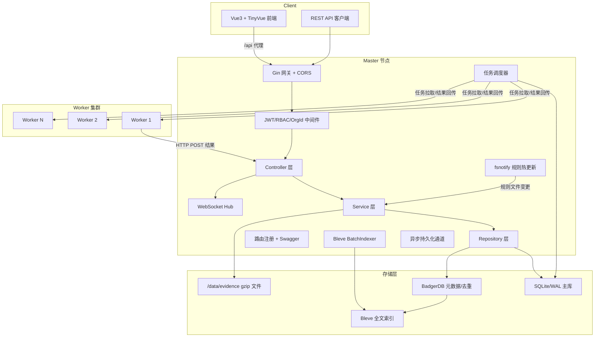
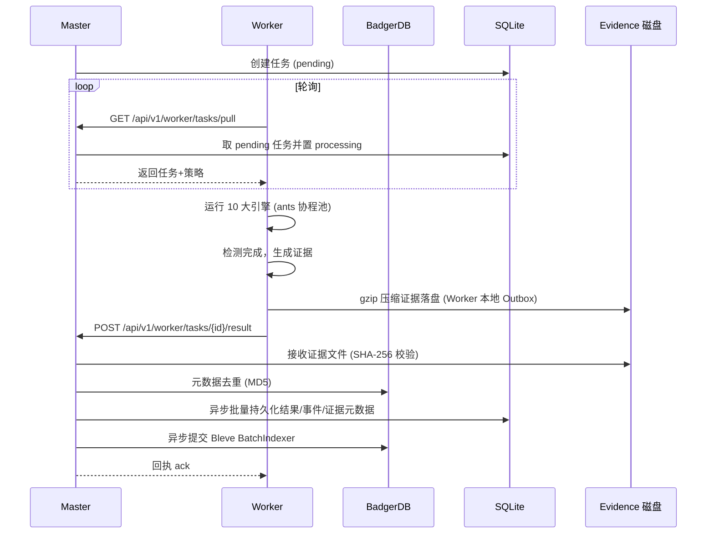
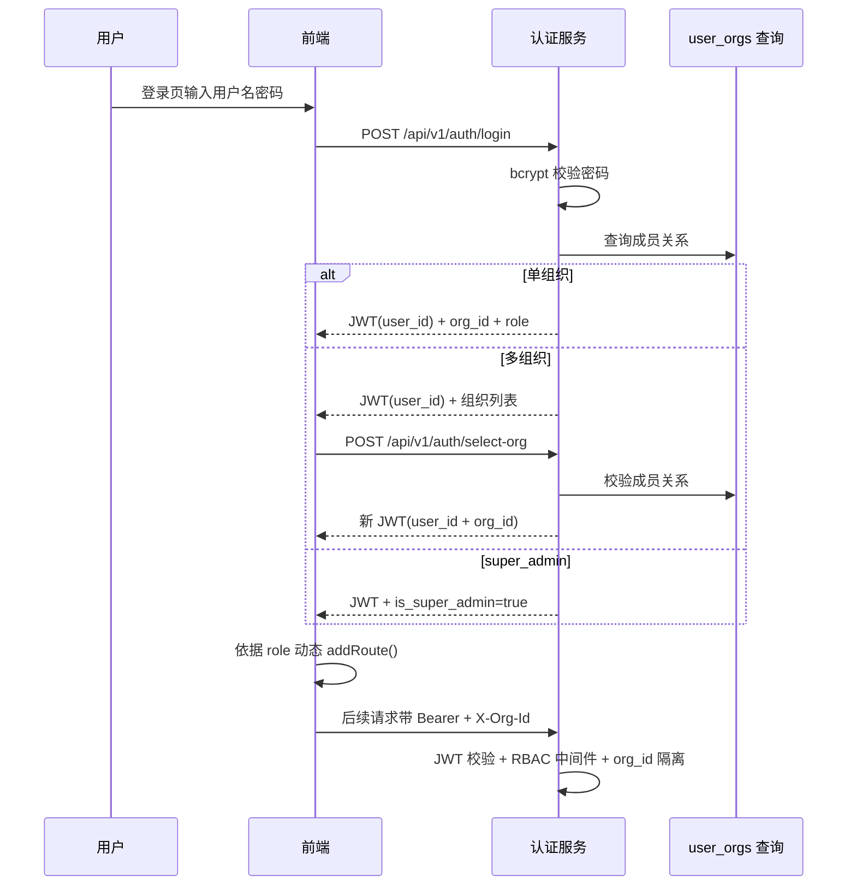
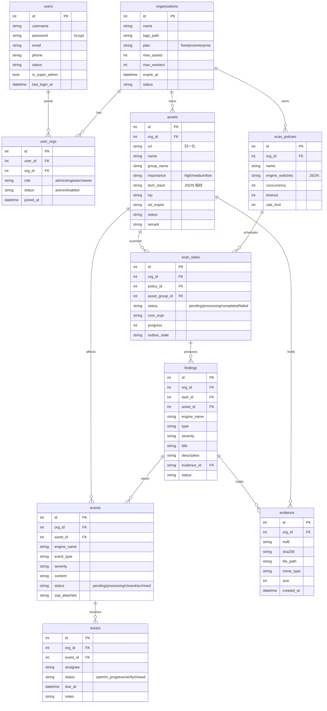

# CInsight 智能监测平台 — 技术设计文档

Feature Name: cinsight-platform
Updated: 2026-08-19
Status: 已确认（技术栈全套 / 全量设计+分阶段实施 / 内嵌库降级方案）

## Description

CInsight 是基于 Master-Worker 架构的多租户安全监测平台。Master 负责 API、任务调度、持久化与证据管理，Worker 负责执行 10 大检测引擎并回传结果。平台以"全量证据链"为核心取证理念，通过 SHA-256 签名保证证据不可篡改，通过多租户 RBAC 保证数据隔离。

技术方案遵循三项用户确认的决策：
1. **全套技术栈落地**：后端 Gin + GORM + SQLite/WAL + BadgerDB + Bleve + ants + gobreaker + fsnotify + swaggo + gorilla/websocket；前端 Vue3 + Vite + Pinia + Router4 + ReconnectingWebSocket + TinyVue。
2. **全量设计 + 分阶段实施**：设计覆盖 10 引擎与 15+ 功能模块，实施按 MVP → 引擎扩展 → 全量功能三个阶段推进。
3. **内嵌库降级方案**：BadgerDB、Bleve 直接作为 Go 内嵌库引入；VictoriaMetrics 时序能力由 SQLite 时序表（`availability_points` / `trend_points`）替代，保留未来迁移接口。

## Architecture

### 总体架构



### Master-Worker 协作时序



### 多租户与 RBAC 认证流程



## Components and Interfaces

### Master 组件

| 组件 | 职责 | 关键接口 |
|------|------|---------|
| Gateway | Gin 引擎、CORS、日志、恢复中间件 | `gin.New()` |
| AuthMiddleware | JWT 校验 + 解析 user_id/org_id | `Authorization: Bearer {jwt}`, `X-Org-Id: {org_id}` |
| RBACMiddleware | 按角色校验写操作权限 | `RequireRoles(role...)`, `RequireWrite()` |
| OrgIsolation | 强制业务查询附带 org_id | `WithOrg(ctx, orgID)` |
| Controller | 各功能模块 HTTP 处理器（验证请求参数） | `assetsController`, `taskController`, `eventController`... |
| Service | 业务逻辑层（脱敏/风暴抑制/证据校验） | `assetsService`, `evidenceService`... |
| Repository | GORM/SQLite + BadgerDB 数据访问 | `assetRepo`, `taskRepo`, `eventRepo`, `kvRepo` |
| TaskScheduler | 任务分发、超时对账、断点续扫状态 | `PullTask()`, `MarkProcessing()`, `AckResult()` |
| WebSocketHub | 实时事件推送、指数退避重连 | `Broadcast(event)` |
| BatchIndexer | Bleve 批量索引（5s/50 条） | `Enqueue(doc)`, `Flush()` |
| RuleWatcher | fsnotify 规则热加载 | `WatchRules()`, `GetRuleHash()` |

### Worker 组件

| 组件 | 职责 | 关键接口 |
|------|------|---------|
| EngineRegistry | 10 大引擎注册表，统一契约 | `Register(name, engine)`, `Get(name)` |
| Scheduler | 拉取任务、并发执行、超时控制 | `PollAndRun()` |
| Reporter | HTTP POST 回传结果 + Outbox 缓存 | `ReportResult()`, `ReplayOutbox()` |
| Engine | 统一引擎接口 | `Run(ctx, target, policy) ([]Finding, error)` |
| localStore | BadgerDB 本地状态（已爬取 URL/Outbox） | `Set`, `Get`, `Scan` |

### 10 大引擎接口契约

```go
type Engine interface {
    Name() string
    Enabled(policy Policy) bool
    Run(ctx context.Context, target Target, policy Policy) ([]Finding, error)
}

type Finding struct {
    Type        string
    Severity    string   // critical/high/medium/low/info
    Title       string
    Description string
    Evidence    *Evidence
    Extra       map[string]any
}
```

| 引擎 | Name | 依赖 |
|------|------|------|
| 漏洞扫描 | `vuln_scan` | POC 库、ants 协程池、gobreaker |
| 内容安全 | `content_security` | AI 文本分类 API + 敏感词库正则双判定 |
| 暗链挂马 | `hidden_link` | 特征库、双 UA 抓取、沙箱行为分析 |
| Webshell | `webshell` | 路径字典、特征码库、流量特征 |
| 钓鱼 | `phishing` | 钓鱼模板库、Levenshtein、证书解析 |
| 可用性 | `availability` | HTTP/DNS/PING 探针、连续失败计数 |
| 端口服务 | `port_service` | TCP SYN 扫描、Banner 抓取 |
| DNS 安全 | `dns_security` | 多节点解析对比、字典爆破 |
| 信誉监测 | `reputation` | 威胁情报库查询 |
| 安全情报 | `intelligence` | CVE/CNVD/CNNVD 订阅、资产匹配 |

## Data Models

### 核心表（SQLite，Master 单写）



### 关键表字段补充

**user_orgs 约束**：`user_orgs` 表不允许 `is_super_admin` 用户插入；平台超管通过全局 `org_id=0` 查询平台数据。

**审计日志表（audit_logs）**：`id, org_id, user_id, username, action, resource_type, resource_id, before_value, after_value, ip, created_at`。禁止 update/delete，仅可 insert/select。

**API Token 表（api_tokens）**：`id, org_id, name, token_hash, scopes(JSON), expires_at, last_used_at`。

**通知渠道表（notify_channels）**：`id, org_id, type(dingtalk/wecom/feishu/smtp), config(JSON), enabled`。

**降噪规则表（noise_rules）**：`id, org_id, type(whitelist_ip/ignore_type/agg_window/storm_limit), config(JSON), enabled`。

**Worker 节点表（worker_nodes）**：`id, org_id, name, ip, version, status, heartbeat_at, load, boot_token`。

**时序降级表（availability_points / trend_points）**：VictoriaMetrics 的内嵌替代。`availability_points(id, org_id, asset_id, engine, timestamp, status_code, latency_ms, up)`, `trend_points(id, org_id, metric, date, value)`。预留 `MetricsExporter` 接口以支持未来切换 VM。

### BadgerDB 存储设计

| Key 前缀 | 用途 |
|---------|------|
| `urlmd5:{md5}` | 资产 URL 去重 |
| `evmd5:{md5}` | 证据 MD5 去重 |
| `local:crawled:{task_id}:{url}` | Worker 断点续扫记录 |
| `outbox:{seq}` | Worker 断网结果缓存 |
| `meta:{key}` | 规则版本、同步 Hash 等 |

### Bleve 索引设计

索引对象：`findings`（标题/描述/URL）、`events`（内容）、`assets`（URL/名称/技术栈）。BatchIndexer 后台协程每 5 秒或凑齐 50 条批量提交，写入失败重试 3 次后降级为直接提交。

## Correctness Properties

1. **写操作权限不变量**：任何 write API 必经 RBAC 中间件，`viewer` 角色一律 403；该约束由中间件全局注册保障，controller 无法绕过。
2. **租户隔离不变量**：所有 Repository 查询强制携带 `org_id`，查询构造器在缺省 `org_id` 时返回错误而非空结果。
3. **证据完整性**：证据文件 gzip 落盘时计算 SHA-256 并入库；读取展示前强制复算校验，不一致返回 `EVIDENCE_TAMPERED` 错误，前端标红。
4. **任务状态机**：`pending → processing → completed/failed`；Master 启动将超时 30min 的 processing 重置为 pending；Worker 断点续扫保证不重复执行已爬取 URL。
5. **告警风暴抑制**：单资产每小时通知上限 5 条，超出静默入库并追加高频提示标记。
6. **熔断保护**：gobreaker 连续失败 5 次熔断目标；扫描授权违规 3 次自动熔断 Worker。
7. **审计不可变**：audit_logs 表仅允许 insert/select，禁止 update/delete。
8. **脱敏一致性**：身份证/手机号/邮箱/AccessKey 在入库前、API 返回前、报告生成时三时机统一脱敏（脱敏规则集中在 utils.Masker）。
9. **super_admin 隔离**：super_admin 不写入 user_orgs，平台数据通过 org_id=0 查询。

## Error Handling

| 场景 | 错误码 | 处理策略 |
|------|--------|---------|
| JWT 缺失/过期/无效 | 401 | 返回 `AUTH_FAILED`，前端清理 token 跳登录 |
| 角色无权限写操作 | 403 | 返回 `FORBIDDEN`，前端隐藏入口 + Toast |
| 缺少 X-Org-Id | 400 | 返回 `ORG_REQUIRED` |
| 证据 Hash 校验失败 | 422 | 返回 `EVIDENCE_TAMPERED`，前端证据抽屉标红 |
| 引擎超时 | 408 | 单 POC `context.WithTimeout(30s)` 中止，记录 finding=timeout |
| 目标连续失败 5 次 | 502 | gobreaker 熔断目标，后续任务跳过并记录 |
| Worker 断网 | - | 结果写入本地 Outbox，指数退避重试回传 |
| SQLite 写冲突 | 409 | GORM 事务重试（最多 3 次），写并发收敛到单协程通道 |
| 规则文件格式错误 | 422 | fsnotify 热加载失败保留旧版本并告警 |
| 通知推送失败 | 500 | 重试 3 次后降级为入库标记，不阻塞主流程 |

统一响应格式：

```json
{ "code": 0, "message": "ok", "data": {} }
```

错误时 `code` 为非 0 业务码，`message` 为人类可读说明。

## Test Strategy

### 后端单元测试（go test）

| 模块 | 覆盖点 |
|------|--------|
| RBAC 中间件 | 四角色 × 读写操作矩阵（表驱动） |
| 认证服务 | bcrypt 校验、JWT 签发、组织选择、锁定阈值 |
| 证据服务 | gzip 落盘、SHA-256 校验、MD5 去重、篡改检测 |
| 任务调度 | 状态机流转、超时对账、断点续扫 |
| 引擎契约 | 各引擎 mock 输入 → finding 输出 |
| 脱敏 | 身份证/手机号/邮箱/AccessKey 三时机脱敏 |

### 集成测试

- Master + 单 Worker 本地联调：任务下发 → 引擎执行 → 结果回传 → 证据入库 → 前端展示全链路。
- SQLite 内存模式 + BadgerDB 临时目录跑通 Repository 层租户隔离查询。
- WebSocket 推送：事件产生后订阅者收到实时通知，断线重连（指数退避）成功。

### 前端测试

- 动态路由按 role 渲染权限（org_admin/engineer/viewer 三套菜单）。
- 证据抽屉 Hash 校验失败时标红提示。
- 万级列表虚拟滚动性能（TinyVue `virtual-scroll`）。

### 性能基准

- Master API 响应 < 100ms（BadgerDB 元数据 + 异步持久化）。
- 单任务 10 资产并发 10 引擎，完成时间 < 5min（可调）。
- 证据入库吞吐 ≥ 100 条/s。

## 分阶段实施计划

### 阶段 1（MVP 闭环）：RBAC + 资产 + 任务 + 证据链

- 技术底座：Gin 脚手架、JWT/RBAC 中间件、SQLite 迁移、统一响应。
- 认证：登录/组织选择/动态路由。
- 资产 CRUD（URL 归一化 + BadgerDB 去重）。
- 任务调度：Master 下发/Worker 拉取/结果回传 + 可用性引擎。
- 证据链：gzip 落盘 + SHA-256 + 前端抽屉（Req/Resp + HTML 高亮）。
- 报告导出（PDF/Excel）。

### 阶段 2（引擎扩展）：10 大引擎全量

- 实现其余 9 大引擎与统一 EngineRegistry。
- 事件中心/漏洞中心/内容安全/暗链/Webshell/钓鱼/端口/DNS/信誉/情报前端模块。
- 告警风暴抑制、降噪规则、工单闭环。

### 阶段 3（全量功能 + 平台化）

- 团队管理/系统设置/平台管理/API Token/Webhook/审计日志。
- 规则热更新（fsnotify）、调度策略模板、定时报告。
- 容灾强化：Outbox 批量回传、Litestream 备份、Worker 熔断。

## References

[^1]: requirements.md - [需求文档](requirements.md)
[^2]: tasklist.md - [实施任务列表](tasklist.md)
