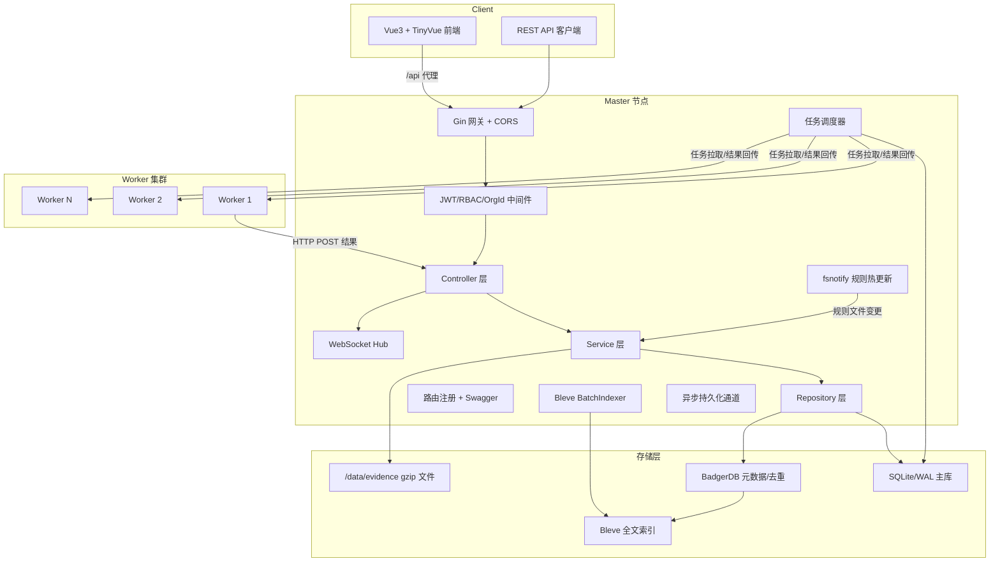
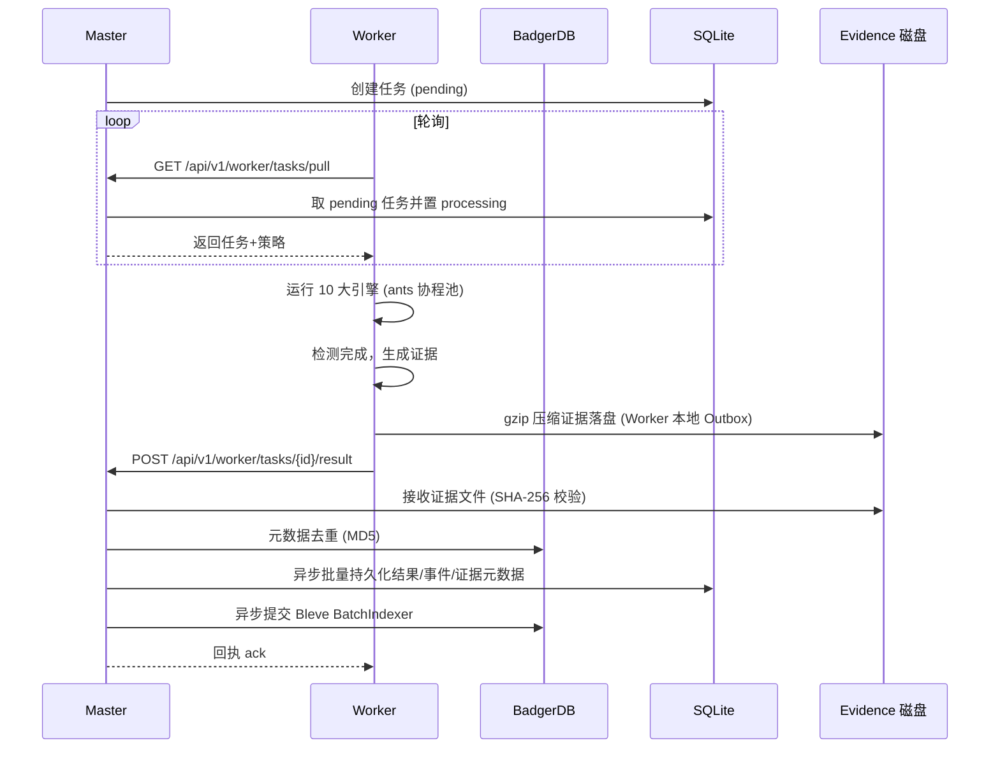
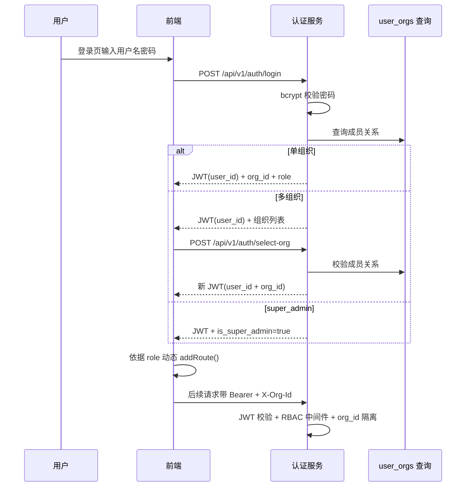
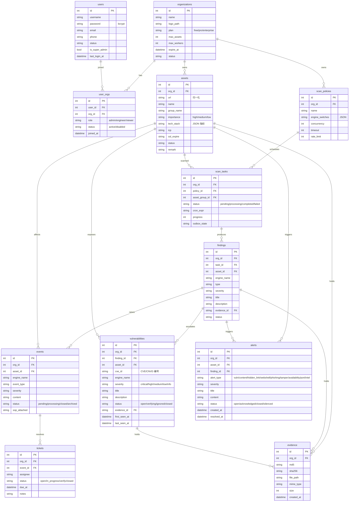

# CInsight 智能监测平台 — 技术设计文档

Feature Name: cinsight-platform
Updated: 2026-08-19
Status: 已确认（技术栈全套 / 全量设计+分阶段实施 / 内嵌库降级方案）

## Description

CInsight 是基于 Master-Worker 架构的多租户安全监测平台。Master 负责 API、任务调度、持久化与证据管理，Worker 负责执行 10 大检测引擎并回传结果。平台以"全量证据链"为核心取证理念，通过 SHA-256 签名保证证据不可篡改，通过多租户 RBAC 保证数据隔离。

技术方案遵循三项用户确认的决策：
1. **全套技术栈落地**：后端 Gin + GORM + SQLite/WAL + BadgerDB + Bleve + ants + gobreaker + fsnotify + swaggo + gorilla/websocket；前端 Vue3 + Vite + Pinia + Router4 + ReconnectingWebSocket + TinyVue。
2. **全量设计 + 分阶段实施**：设计覆盖 10 引擎与 15+ 功能模块，实施按 MVP → 引擎扩展 → 全量功能三个阶段推进。
3. **内嵌库降级方案**：BadgerDB、Bleve 直接作为 Go 内嵌库引入；VictoriaMetrics 时序能力由 SQLite 时序表（`availability_points` / `trend_points`）替代，保留未来迁移接口。

## Architecture

### 总体架构



### Master-Worker 协作时序



### 多租户与 RBAC 认证流程



## Components and Interfaces

### Master 组件

| 组件 | 职责 | 关键接口 |
|------|------|---------|
| Gateway | Gin 引擎、CORS、日志、恢复中间件 | `gin.New()` |
| AuthMiddleware | JWT 校验 + 解析 user_id/org_id | `Authorization: Bearer {jwt}`, `X-Org-Id: {org_id}` |
| RBACMiddleware | 按角色校验写操作权限 | `RequireRoles(role...)`, `RequireWrite()` |
| OrgIsolation | 强制业务查询附带 org_id | `WithOrg(ctx, orgID)` |
| Controller | 各功能模块 HTTP 处理器（验证请求参数） | `assetsController`, `taskController`, `eventController`... |
| Service | 业务逻辑层（脱敏/风暴抑制/证据校验） | `assetsService`, `evidenceService`... |
| Repository | GORM/SQLite + BadgerDB 数据访问 | `assetRepo`, `taskRepo`, `eventRepo`, `kvRepo` |
| TaskScheduler | 任务分发、超时对账、断点续扫状态 | `PullTask()`, `MarkProcessing()`, `AckResult()` |
| WebSocketHub | 实时事件推送、指数退避重连 | `Broadcast(event)` |
| BatchIndexer | Bleve 批量索引（5s/50 条） | `Enqueue(doc)`, `Flush()` |
| RuleWatcher | fsnotify 规则热加载 | `WatchRules()`, `GetRuleHash()` |

### Worker 组件

| 组件 | 职责 | 关键接口 |
|------|------|---------|
| EngineRegistry | 10 大引擎注册表，统一契约 | `Register(name, engine)`, `Get(name)` |
| Scheduler | 拉取任务、并发执行、超时控制 | `PollAndRun()` |
| Reporter | HTTP POST 回传结果 + Outbox 缓存 | `ReportResult()`, `ReplayOutbox()` |
| Engine | 统一引擎接口 | `Run(ctx, target, policy) ([]Finding, error)` |
| localStore | BadgerDB 本地状态（已爬取 URL/Outbox） | `Set`, `Get`, `Scan` |

### 10 大引擎接口契约

```go
type Engine interface {
    Name() string
    Enabled(policy Policy) bool
    Run(ctx context.Context, target Target, policy Policy) ([]Finding, error)
}

type Finding struct {
    Type        string
    Severity    string   // critical/high/medium/low/info
    Title       string
    Description string
    Evidence    *Evidence
    Extra       map[string]any
}
```

| 引擎 | Name | 依赖 |
|------|------|------|
| 漏洞扫描 | `vuln_scan` | POC 库、ants 协程池、gobreaker |
| 内容安全 | `content_security` | AI 文本分类 API + 敏感词库正则双判定 |
| 暗链挂马 | `hidden_link` | 特征库、双 UA 抓取、沙箱行为分析 |
| Webshell | `webshell` | 路径字典、特征码库、流量特征 |
| 钓鱼 | `phishing` | 钓鱼模板库、Levenshtein、证书解析 |
| 可用性 | `availability` | HTTP/DNS/PING 探针、连续失败计数 |
| 端口服务 | `port_service` | TCP SYN 扫描、Banner 抓取 |
| DNS 安全 | `dns_security` | 多节点解析对比、字典爆破 |
| 信誉监测 | `reputation` | 威胁情报库查询 |
| 安全情报 | `intelligence` | CVE/CNVD/CNNVD 订阅、资产匹配 |

## API 设计规范

### 统一约定

- 基础前缀 `/api/v1`；Worker 内部接口前缀 `/api/v1/worker`（仅 Bootstrap Token 认证）。
- 统一响应格式 `{ "code": 0, "message": "ok", "data": {} }`，错误时 `code` 非 0 业务码。
- 列表接口统一分页：`page`（从 1 起）、`page_size`（默认 20，上限 200），响应 `data.list` + `data.total`。
- 排序参数 `sort=field,-field`（`-` 表示倒序）；筛选参数 `filter[字段]=值`。
- 时间戳统一 RFC3339（`2006-01-02T15:04:05Z07:00`）；大体积文件统一 gzip。
- 鉴权分层：
  - **JWT 用户鉴权**（前端会话）：`Authorization: Bearer {jwt}` + `X-Org-Id: {org_id}`，经 AuthMiddleware + RBACMiddleware。
  - **API Token 鉴权**（开放集成）：`Authorization: Bearer {api_token}` + `X-Org-Id: {org_id}`，scopes 细粒度控制，独立于 JWT。
  - **Worker Bootstrap Token**（Worker 内部）：`Authorization: Bearer {boot_token}`，仅限 `/api/v1/worker/*`。

### REST 端点清单

| 模块 | 方法 | 路径 | 权限 | 说明 |
|------|------|------|------|------|
| 认证 | POST | /api/v1/auth/login | 公开 | 登录，bcrypt 校验 + JWT |
| 认证 | POST | /api/v1/auth/select-org | 登录用户 | 组织选择，换发带 org_id 的 JWT |
| 认证 | POST | /api/v1/auth/logout | 登录用户 | 退出登录 |
| 认证 | GET | /api/v1/auth/me | 登录用户 | 当前用户信息 + 组织列表 |
| 组织 | GET | /api/v1/orgs | super_admin | 组织列表 |
| 组织 | POST | /api/v1/orgs | super_admin | 创建组织 |
| 组织 | PUT | /api/v1/orgs/:id | super_admin | 编辑组织 |
| 组织 | POST | /api/v1/orgs/:id/disable | super_admin | 禁用组织 |
| 平台 | GET | /api/v1/platform/stats | super_admin | 平台统计 |
| 平台 | GET | /api/v1/platform/workers | super_admin | 平台 Worker 总览 |
| 资产 | GET/POST | /api/v1/assets | org_admin/engineer | 资产列表/创建 |
| 资产 | PUT/DELETE | /api/v1/assets/:id | org_admin/engineer | 资产编辑/删除 |
| 资产 | GET | /api/v1/assets/:id | 全部角色 | 资产详情 |
| 资产 | GET | /api/v1/assets/:id/history | 全部角色 | 资产变更追踪 |
| 资产 | GET | /api/v1/assets/:id/profile | 全部角色 | 资产画像（指纹/ICP/SSL/端口） |
| 资产 | GET/POST | /api/v1/wechat-assets | org_admin/engineer | 微信公众号资产 |
| 策略 | GET/POST | /api/v1/policies | org_admin | 策略模板列表/创建 |
| 策略 | PUT/DELETE | /api/v1/policies/:id | org_admin | 策略模板编辑/删除 |
| 计划 | GET/POST | /api/v1/scan-plans | org_admin | Cron 定时计划 |
| 计划 | PUT/DELETE | /api/v1/scan-plans/:id | org_admin | Cron 定时计划编辑/删除 |
| 任务 | GET/POST | /api/v1/tasks | org_admin/engineer | 任务列表/发起 |
| 任务 | POST | /api/v1/tasks/:id/stop | org_admin/engineer | 停止任务 |
| 任务 | GET | /api/v1/tasks/:id/progress | 全部角色 | 断点续扫状态 |
| 任务 | GET | /api/v1/tasks/queue | 全部角色 | 队列监控 |
| 事件 | GET | /api/v1/events | 全部角色 | 事件列表（筛选/分页） |
| 事件 | POST | /api/v1/events/:id/status | org_admin/engineer | 事件状态流转 |
| 事件 | GET/POST | /api/v1/noise-rules | org_admin | 降噪规则 |
| 告警 | GET | /api/v1/alerts | 全部角色 | 告警列表（筛选/分页） |
| 告警 | PATCH | /api/v1/alerts/:id | org_admin/engineer | 告警处置（确认/关闭/静默） |
| 漏洞 | GET | /api/v1/vulnerabilities | 全部角色 | 漏洞列表（等级/状态/引擎筛选） |
| 漏洞 | GET | /api/v1/vulnerabilities/:id/evidence | 全部角色 | 漏洞证据链（证据抽屉数据） |
| 漏洞 | POST | /api/v1/vulnerabilities/:id/ticket | org_admin/engineer | 生成工单 |
| 漏洞 | POST | /api/v1/vulnerabilities/:id/retest | org_admin/engineer | 申请复测 |
| 漏洞 | POST | /api/v1/vulnerabilities/:id/ignore | org_admin/engineer | 批量忽略 |
| 工单 | GET/POST | /api/v1/tickets | org_admin/engineer | 工单列表/创建 |
| 工单 | PUT | /api/v1/tickets/:id | org_admin/engineer | 工单状态/派发 |
| 证据 | GET | /api/v1/evidence/:id | 全部角色 | 通用证据读取（Req/Resp/HTML/截图，Hash 校验） |
| 证据 | GET | /api/v1/evidence/:id/download | 全部角色 | 下载 HTML/HAR |
| 证据 | POST | /api/v1/evidence/screenshots | org_admin/engineer | 截图上传 |
| 报告 | GET/POST | /api/v1/reports | 全部角色(导出) | 报告列表/生成 |
| 报告 | GET | /api/v1/reports/:id/download | 全部角色 | PDF/Excel 下载 |
| 报告 | GET/POST | /api/v1/report-templates | org_admin | 报告模板 |
| 成员 | GET/POST | /api/v1/members | org_admin | 成员列表/邀请 |
| 成员 | PUT | /api/v1/members/:id | org_admin | 修改角色 |
| 成员 | POST | /api/v1/members/:id/disable | org_admin | 禁用成员 |
| Worker | GET | /api/v1/worker/nodes | org_admin | Worker 节点管理 |
| Worker | GET/POST | /api/v1/worker/nodes/:id/boot-token | org_admin | Bootstrap Token |
| 通知 | GET/POST | /api/v1/notify-channels | org_admin | 通知渠道 |
| 通知 | POST | /api/v1/notify-channels/:id/test | org_admin | 测试发送 |
| 规则库 | GET | /api/v1/rules | org_admin | 规则库版本/内容 |
| 规则库 | PUT | /api/v1/rules | org_admin | 规则热更新 |
| 审计 | GET | /api/v1/audit-logs | org_admin | 审计日志（只读） |
| Token | GET/POST | /api/v1/api-tokens | org_admin | API Token 管理 |
| Token | DELETE | /api/v1/api-tokens/:id | org_admin | 撤销 Token |
| Webhook | GET/POST | /api/v1/webhooks | org_admin | Webhook 配置 |
| Webhook | DELETE | /api/v1/webhooks/:id | org_admin | 删除 Webhook |
| Worker | GET | /api/v1/worker/tasks/pull | Worker Token | 拉取任务 |
| Worker | POST | /api/v1/worker/tasks/:id/result | Worker Token | 回传结果 |
| Worker | POST | /api/v1/worker/heartbeat | Worker Token | 心跳上报 |
| 实时 | GET | /api/v1/ws/events | 登录用户 | WebSocket 事件流 |

### WebSocket 协议（/api/v1/ws/events）

- 连接鉴权：`?token={jwt}` 或首个消息携带 token，握手校验 X-Org-Id。
- 消息帧（JSON）：
  - 上行：`{"type":"subscribe","channels":["event","finding"]}` / `{"type":"ping"}`
  - 下行：`{"type":"event","data":{...}}` / `{"type":"finding","data":{...}}` / `{"type":"pong"}`
- 断线策略：ReconnectingWebSocket 指数退避重连（1s→2s→4s…上限 60s），订阅在重连后自动恢复。

### Webhook 推送协议

- 事件发生时 Master 主动 `POST {customer_url}`，Payload：
  ```json
  {
    "event_type": "finding.critical",
    "org_id": 1,
    "asset_id": 100,
    "title": "...",
    "severity": "critical",
    "evidence_id": 88,
    "timestamp": "2026-08-19T10:00:00Z"
  }
  ```
- 推送失败重试 3 次（指数退避），最终失败落库标记，不阻塞主流程。
- 签名：`X-Webhook-Signature: HMAC-SHA256(payload, secret)`，供客户验签。

## Data Models

### 核心表（SQLite，Master 单写）



### 关键表字段补充

**user_orgs 约束**：`user_orgs` 表不允许 `is_super_admin` 用户插入；平台超管通过全局 `org_id=0` 查询平台数据。

**审计日志表（audit_logs）**：`id, org_id, user_id, username, action, resource_type, resource_id, before_value, after_value, ip, created_at`。禁止 update/delete，仅可 insert/select。

**API Token 表（api_tokens）**：`id, org_id, name, token_hash, scopes(JSON), expires_at, last_used_at`。

**通知渠道表（notify_channels）**：`id, org_id, type(dingtalk/wecom/feishu/smtp), config(JSON), enabled`。

**降噪规则表（noise_rules）**：`id, org_id, type(whitelist_ip/ignore_type/agg_window/storm_limit), config(JSON), enabled`。

**Worker 节点表（worker_nodes）**：`id, org_id, name, ip, version, status, heartbeat_at, load, boot_token`。

**时序降级表（availability_points / trend_points）**：VictoriaMetrics 的内嵌替代。`availability_points(id, org_id, asset_id, engine, timestamp, status_code, latency_ms, up)`, `trend_points(id, org_id, metric, date, value)`。预留 `MetricsExporter` 接口以支持未来切换 VM。

**微信公众号资产表（wechat_assets）**：`id, org_id, app_name(公众号名), wechat_id(微信号), avatar_url, fans_count, intro(简介), verify_status(认证状态), article_count(文章数), status, created_at`。

**证据-截图关联（evidence_files）**：`id, evidence_id, org_id, kind(html/har/screenshot/req/resp), file_path, md5, sha256, size, created_at`，支持一条证据链多文件（Req/Resp/HTML/截图各一文件）。

### 字段类型与约束规范

| 类型 | 说明 |
|------|------|
| 主键 `id` | INTEGER PRIMARY KEY AUTOINCREMENT |
| 外键 | 统一 `INTEGER NOT NULL`，声明 `REFERENCES`，启用 `PRAGMA foreign_keys=ON` |
| 时间 | DATETIME，存 RFC3339；默认 `CURRENT_TIMESTAMP` |
| 枚举状态 | TEXT + CHECK 约束（如 `status IN ('pending','processing','completed','failed')`） |
| JSON 字段 | TEXT，入库/读取经 `json.Marshal/Unmarshal` |

### 索引设计

| 表 | 索引 | 目的 |
|----|------|------|
| 所有业务表 | `idx_{table}_org`（org_id） | 多租户隔离强制索引 |
| user_orgs | `idx_user_orgs_user`, `idx_user_orgs_org` | 成员关系查询 |
| assets | `idx_assets_org_url`, `idx_assets_org_group`, `idx_assets_org_importance` | 资产筛选 |
| scan_tasks | `idx_tasks_org_status`, `idx_tasks_org_created` | 队列监控/状态流转 |
| findings | `idx_findings_org_severity`, `idx_findings_org_engine`, `idx_findings_org_status` | 漏洞筛选 |
| vulnerabilities | `idx_vuln_org_severity`, `idx_vuln_org_status`, `idx_vuln_org_asset`, `idx_vuln_org_cve` | 漏洞列表/资产关联/CVE 检索 |
| alerts | `idx_alerts_org_status`, `idx_alerts_org_type`, `idx_alerts_org_severity`, `idx_alerts_org_asset` | 告警筛选/处置 |
| events | `idx_events_org_status`, `idx_events_org_type`, `idx_events_org_severity` | 事件筛选 |
| evidence | `idx_evidence_org_md5` | 证据去重 |
| availability_points | `idx_avail_org_asset_ts`（org_id, asset_id, timestamp） | 时序查询 |
| trend_points | `idx_trend_org_metric_date` | 趋势聚合 |
| api_tokens | `idx_token_org` | Token 查询 |
| worker_nodes | `idx_worker_org` | 节点管理 |
| audit_logs | `idx_audit_org_created` | 审计查询 |

### 迁移策略

- 使用 GORM `AutoMigrate` 初始建表 + 版本化迁移表 `schema_migrations`（version, applied_at）。
- 每次变更新增迁移函数（`up/down`），按版本号顺序执行，重复执行幂等。
- 开发环境 `AutoMigrate` 一键同步；生产环境执行显式迁移命令 `master migrate --to={version}`。
- 种子数据：启动时自动写入 `super_admin` 默认账户（首次初始化密码随机生成并打印一次）、初始策略模板、初始 POC/敏感词/木马特征库。

### SQLite 连接与 WAL 配置

```go
db, _ := gorm.Open(sqlite.Open("file:cinsight.db?_pragma=journal_mode(WAL)&_pragma=busy_timeout(5000)&_pragma=synchronous(NORMAL)&_pragma=foreign_keys(ON)"))
db.DB().SetMaxOpenConns(1)   // Master 单写
db.DB().SetMaxIdleConns(1)
```

### BadgerDB-SQLite 缓存一致性

- 写入链路：Master 接收结果 → 先写 BadgerDB 元数据（即时可查）→ 异步批量持久化 SQLite（成功 ack）。
- 读取链路：API 优先读 BadgerDB 元数据；未命中回源 SQLite 并回填。
- 对账：每小时后台协程以 SQLite 为准对账 BadgerDB，清理脏 key；写 SQLite 失败重试 3 次后进入死信队列并告警。

### BadgerDB 存储设计

| Key 前缀 | 用途 |
|---------|------|
| `urlmd5:{md5}` | 资产 URL 去重 |
| `evmd5:{md5}` | 证据 MD5 去重 |
| `local:crawled:{task_id}:{url}` | Worker 断点续扫记录 |
| `outbox:{seq}` | Worker 断网结果缓存 |
| `meta:{key}` | 规则版本、同步 Hash 等 |

### Bleve 索引设计

索引对象：`findings`（标题/描述/URL）、`events`（内容）、`assets`（URL/名称/技术栈）。BatchIndexer 后台协程每 5 秒或凑齐 50 条批量提交，写入失败重试 3 次后降级为直接提交。

## 前端架构设计

### 目录结构（frontend/src）

```
src/
├── api/                 # API 层（按模块拆分，统一 axios 实例）
│   ├── http.ts          # axios 封装（Bearer + X-Org-Id + 401 拦截 + 错误提示）
│   ├── auth.ts          # login/select-org/logout/me
│   ├── asset.ts         # 资产 CRUD/画像/历史/公众号
│   ├── task.ts          # 任务/策略/计划/队列
│   ├── event.ts         # 事件/工单/降噪
│   ├── finding.ts       # 漏洞/证据
│   ├── report.ts        # 报告
│   ├── admin.ts         # 团队/设置/平台/Token/Webhook
│   └── ws.ts            # WebSocket 封装（订阅/重连）
├── stores/              # Pinia
│   ├── auth.ts          # token/用户/当前组织/role
│   ├── menu.ts          # 动态菜单与路由
│   ├── asset.ts         # 资产列表状态
│   ├── event.ts         # 实时事件流（WebSocket 写入）
│   └── dashboard.ts     # 仪表盘聚合数据
├── router/              # 静态路由 + 动态 addRoute()
├── layouts/             # 顶部导航/侧边菜单/组织切换
├── views/               # 页面（按 RBAC 懒加载）
├── components/          # 复用组件（证据抽屉/图表/脱敏显示）
└── utils/               # 格式化/脱敏展示/时间/下载
```

### 状态管理（Pinia store 划分）

| store | 职责 | 关键状态 |
|-------|------|---------|
| auth | 登录态/组织/角色 | token, user, orgId, role, isSuperAdmin |
| menu | 动态菜单 | routes, menus（按 role 生成） |
| asset | 资产列表筛选 | filters, list, total, page |
| event | 实时事件 | realtimeEvents（WebSocket 追加），unreadCount |
| dashboard | 仪表盘 | stats, trends, topRisk, engineCoverage |

### 图表选型

- 10 大引擎覆盖雷达图、7 天趋势图、24h 响应折线图、12h 可用性点阵图统一采用 **ECharts**（`echarts` npm 包）。
- 图标统一 TinyVue 内置 Icon（`@opentiny/vue-icon`），页面组件全部使用 TinyVue，图表容器以 TinyVue Card/Tabs 包裹，视觉风格与 TinyVue 主题（`@opentiny/vue-theme`）一致。
- 可用性点阵图/热力图可用 ECharts `heatmap` 系列渲染红绿竖线。

### 虚拟滚动与大数据量

- 万级资产/事件/漏洞列表启用 TinyVue Grid `virtual-scroll`（`:virtual-scroll="{ enabled: true, itemHeight: 44 }"`）。
- 列表接口强制分页（page/page_size），前端滚动加载缓存已拉取页；WebSocket 新事件预插入头部并计数。

### 脱敏展示

- 后端已三时机脱敏；前端 `utils/masker.ts` 兜底对身份证/手机号/邮箱展示打码，报告下载前二次确认权限。

### WebSocket 集成

- `api/ws.ts` 封装 ReconnectingWebSocket：连接 `/api/v1/ws/events?token=...`，指数退避重连，自动重订阅。
- 事件分发到 Pinia `event` store，顶部通知角标实时更新；断线期间事件以后端轮询接口兜底补齐。

## Correctness Properties

1. **写操作权限不变量**：任何 write API 必经 RBAC 中间件，`viewer` 角色一律 403；该约束由中间件全局注册保障，controller 无法绕过。
2. **租户隔离不变量**：所有 Repository 查询强制携带 `org_id`，查询构造器在缺省 `org_id` 时返回错误而非空结果。
3. **证据完整性**：证据文件 gzip 落盘时计算 SHA-256 并入库；读取展示前强制复算校验，不一致返回 `EVIDENCE_TAMPERED` 错误，前端标红。
4. **任务状态机**：`pending → processing → completed/failed`；Master 启动将超时 30min 的 processing 重置为 pending；Worker 断点续扫保证不重复执行已爬取 URL。
5. **告警风暴抑制**：单资产每小时通知上限 5 条，超出静默入库并追加高频提示标记。
6. **熔断保护**：gobreaker 连续失败 5 次熔断目标；扫描授权违规 3 次自动熔断 Worker。
7. **审计不可变**：audit_logs 表仅允许 insert/select，禁止 update/delete。
8. **脱敏一致性**：身份证/手机号/邮箱/AccessKey 在入库前、API 返回前、报告生成时三时机统一脱敏（脱敏规则集中在 utils.Masker）。
9. **super_admin 隔离**：super_admin 不写入 user_orgs，平台数据通过 org_id=0 查询。

## Error Handling

| 场景 | 错误码 | 处理策略 |
|------|--------|---------|
| JWT 缺失/过期/无效 | 401 | 返回 `AUTH_FAILED`，前端清理 token 跳登录 |
| 角色无权限写操作 | 403 | 返回 `FORBIDDEN`，前端隐藏入口 + Toast |
| 缺少 X-Org-Id | 400 | 返回 `ORG_REQUIRED` |
| 证据 Hash 校验失败 | 422 | 返回 `EVIDENCE_TAMPERED`，前端证据抽屉标红 |
| 引擎超时 | 408 | 单 POC `context.WithTimeout(30s)` 中止，记录 finding=timeout |
| 目标连续失败 5 次 | 502 | gobreaker 熔断目标，后续任务跳过并记录 |
| Worker 断网 | - | 结果写入本地 Outbox，指数退避重试回传 |
| SQLite 写冲突 | 409 | GORM 事务重试（最多 3 次），写并发收敛到单协程通道 |
| 规则文件格式错误 | 422 | fsnotify 热加载失败保留旧版本并告警 |
| 通知推送失败 | 500 | 重试 3 次后降级为入库标记，不阻塞主流程 |

统一响应格式：

```json
{ "code": 0, "message": "ok", "data": {} }
```

错误时 `code` 为非 0 业务码，`message` 为人类可读说明。

### 错误码枚举

| 码段 | 含义 |
|------|------|
| 0 | 成功 |
| 1000-1099 | 参数校验（`VALIDATION_FAILED` 1000、`ORG_REQUIRED` 1001、`INVALID_FORMAT` 1002） |
| 2000-2099 | 认证（`AUTH_FAILED` 2000、`TOKEN_EXPIRED` 2001、`ACCOUNT_LOCKED` 2002） |
| 2100-2199 | 授权（`FORBIDDEN` 2100、`SCOPE_DENIED` 2101） |
| 3000-3099 | 业务冲突（`DUPLICATE_URL` 3000、`TASK_STATE_CONFLICT` 3001、`ORG_LIMIT_EXCEEDED` 3002） |
| 4000-4099 | 资源（`NOT_FOUND` 4000、`EVIDENCE_TAMPERED` 4001、`RULE_VERSION_MISMATCH` 4002） |
| 5000-5099 | 引擎/任务（`ENGINE_TIMEOUT` 5000、`TARGET_BREAKER_OPEN` 5001、`WORKER_UNAUTHORIZED` 5002） |
| 6000-6099 | 外部依赖（`NOTIFY_FAILED` 6000、`INTEL_SOURCE_OFFLINE` 6001） |

## 配置与环境变量

| 变量 | 默认值 | 说明 |
|------|--------|------|
| `PORT` | 8080 | Master HTTP 端口 |
| `CINSIGHT_DB_PATH` | ./data/cinsight.db | SQLite 路径 |
| `CINSIGHT_DATA_DIR` | /data | 证据/规则/日志根目录（`/data/evidence`、`/data/rules`、`/data/logs`） |
| `CINSIGHT_JWT_SECRET` | 必填 | JWT 签名密钥（64 字符随机） |
| `CINSIGHT_JWT_TTL` | 24h | 登录 JWT 有效期 |
| `CINSIGHT_SUPER_ADMIN_USER` | admin | 初始超管用户名 |
| `CINSIGHT_RULES_DIR` | /data/rules | fsnotify 监听规则目录 |
| `CINSIGHT_LITESTREAM_URI` | 空 | Litestream 备份目标（S3/文件） |
| `CINSIGHT_NOTIFY_RETRY` | 3 | 通知/Webhook 重试次数 |
| `CINSIGHT_WORKER_POLL_MS` | 3000 | Worker 任务轮询间隔 |
| `CINSIGHT_ANT_CONCURRENCY` | 20 | Worker ants 协程池大小 |
| `CINSIGHT_PROXY_URL` | 空 | 反封禁 Proxy（HTTP/SOCKS5） |
| `CINSIGHT_STORM_LIMIT_PER_HOUR` | 5 | 单资产每小时告警上限 |

### 日志与请求追踪

- 统一结构化日志（logrus/slog），输出 JSON，字段含 `ts, level, org_id, user_id, request_id, path, latency_ms, status`。
- 请求中间件生成 `request_id`（UUID），贯穿 Controller→Service→Repository→外部调用，异常堆栈附带 request_id。
- 审计日志独立落库（audit_logs），仅 insert/select。
- 日志轮转：`/data/logs` 按天 + 大小轮转（默认 50MB），保留 14 天。

## Test Strategy

### 后端单元测试（go test）

| 模块 | 覆盖点 |
|------|--------|
| RBAC 中间件 | 四角色 × 读写操作矩阵（表驱动） |
| 认证服务 | bcrypt 校验、JWT 签发、组织选择、锁定阈值 |
| 证据服务 | gzip 落盘、SHA-256 校验、MD5 去重、篡改检测 |
| 任务调度 | 状态机流转、超时对账、断点续扫 |
| 引擎契约 | 各引擎 mock 输入 → finding 输出 |
| 脱敏 | 身份证/手机号/邮箱/AccessKey 三时机脱敏 |

### 集成测试

- Master + 单 Worker 本地联调：任务下发 → 引擎执行 → 结果回传 → 证据入库 → 前端展示全链路。
- SQLite 内存模式 + BadgerDB 临时目录跑通 Repository 层租户隔离查询。
- WebSocket 推送：事件产生后订阅者收到实时通知，断线重连（指数退避）成功。

### 前端测试

- 动态路由按 role 渲染权限（org_admin/engineer/viewer 三套菜单）。
- 证据抽屉 Hash 校验失败时标红提示。
- 万级列表虚拟滚动性能（TinyVue `virtual-scroll`）。

### 性能基准

- Master API 响应 < 100ms（BadgerDB 元数据 + 异步持久化）。
- 单任务 10 资产并发 10 引擎，完成时间 < 5min（可调）。
- 证据入库吞吐 ≥ 100 条/s。

## 分阶段实施计划

### 阶段 1（MVP 闭环）：RBAC + 资产 + 任务 + 证据链

- 技术底座：Gin 脚手架、JWT/RBAC 中间件、SQLite 迁移、统一响应、Swagger 文档集成（swag init + /swagger/* 端点）。
- 认证：登录/组织选择/动态路由。
- 资产 CRUD（URL 归一化 + BadgerDB 去重，含微信公众号资产字段：公众号名/微信号/头像/粉丝数/简介/认证状态/文章数）。
- 任务调度：Master 下发/Worker 拉取/结果回传 + 可用性引擎。
- 证据链：gzip 落盘 + SHA-256 + 截图上传接口（POST /api/v1/evidence/screenshots）+ 前端抽屉（Req/Resp + HTML 高亮）。
- 报告导出（PDF/Excel）。

### 阶段 2（引擎扩展）：10 大引擎全量

- 实现其余 9 大引擎与统一 EngineRegistry。
- 事件中心/漏洞中心/内容安全/暗链/Webshell/钓鱼/端口/DNS/信誉/情报前端模块。
- 告警风暴抑制、降噪规则、工单闭环。

### 阶段 3（全量功能 + 平台化）

- 团队管理/系统设置/平台管理/API Token/Webhook/审计日志。
- 规则热更新（fsnotify）、调度策略模板、定时报告。
- 容灾强化：Outbox 批量回传、Litestream 热备（任务 15）、Worker 熔断。
- 部署（任务 15）：Docker/K8s 编排（Master 水平扩展读写分离 + Worker 弹性伸缩 HPA）、私有化单二进制一键安装。
- 部署验证：三种部署方式启动 → /api/health 探活 → 建资产 → 下发任务全链路验收。

### 必执行验证（各阶段验收统一要求）

- 单元测试：阶段 1/2 单测（RBAC/认证/证据/调度/引擎/脱敏）与 `go test ./...` 全部通过。
- 前端构建验证：`vue-tsc + vite build` 全部阶段通过。
- 部署验证：Docker/K8s/单二进制三种方式启动 + 探活 + 全链路通过（任务 15）。

## References

[^1]: requirements.md - [需求文档](requirements.md)
[^2]: tasklist.md - [实施任务列表](tasklist.md)
